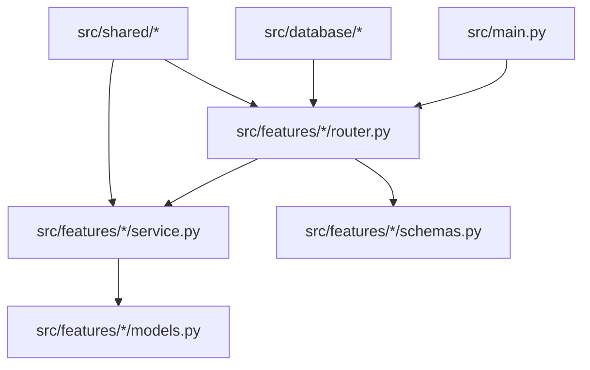
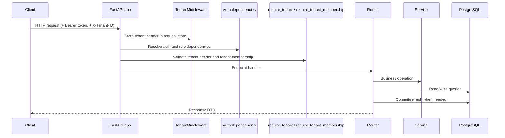
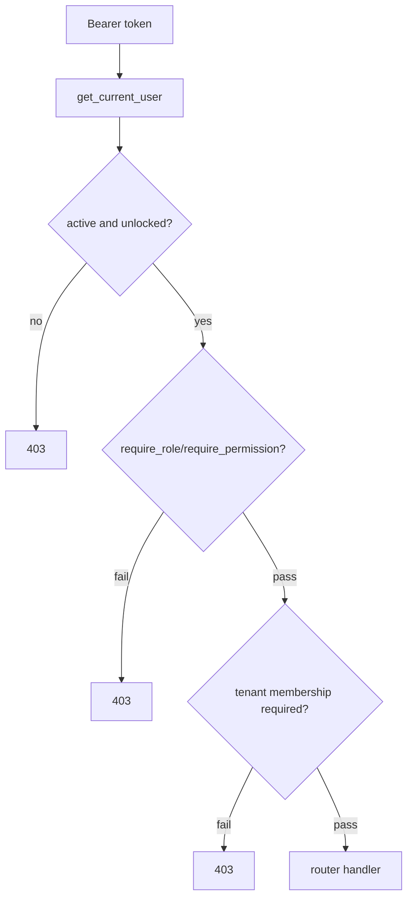
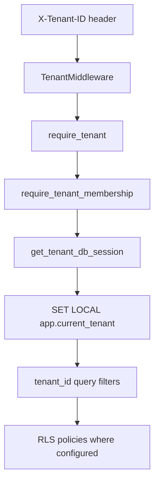

# CLAUDE.md

## 1. Purpose

- This file is the implementation-verified reference manual for autonomous coding agents working in this repository.
- When external runtime configuration instructs the agent to follow `CLAUDE.md`, this file defines the default repository rules unless a more specific scoped agent file exists.

Source-of-truth order:

1. Codebase (`src/`, `tests/`, `alembic/`)
2. Feature documentation (`docs/features/`)

Rules:

- Do not invent behavior, architecture, constraints, or flows not supported by the codebase.
- If docs and code differ, trust code and update docs to match code.

---

## 2. System Architecture

Mindflow API is a FastAPI backend organized by feature modules under `src/features/`.

Core runtime composition (`src/main.py`):

- App setup: `CustomFastAPI` with custom OpenAPI generation
- Middleware: SlowAPI, admin docs middleware, CORS, tenant header extraction, audit context middleware
- Router groups:
- Public routers: `auth`, `user`, `tenant`, plus the internal QStash callback routers for `export` and `notification`
- Tenant-protected routers: `export`, `finance`, `notification`, `schedule_config`, `schedule`, `patient`, `medical_record`
- Lifespan hooks initialize database and Redis resources, then either prepare QStash callback resources or start the resident export worker and notification runtime before closing resources on shutdown

Layer responsibilities:

- Router: HTTP input/output, dependency wiring, response shaping, transaction boundaries
- Service: business rules and query orchestration
- Model: SQLAlchemy entities and constraints
- Schema: request/response validation contracts
- Exceptions: feature-specific HTTP errors

---

## 3. Request Lifecycle

Implemented flow for tenant-protected endpoints:

Runtime details:

- `get_session()` auto-commits on success and rolls back on exception.
- Routers still perform explicit `await session.commit()` for write endpoints.
- Services may `flush()` but do not own final commit.
- OpenAPI adds `TenantHeader` security only to routes depending on `require_tenant`.

---

## 4. Feature-Based Architecture

Current feature modules in `src/features/`:

- `auth`
- `user`
- `tenant`
- `export`
- `finance`
- `notification`
- `schedule_config`
- `patient`
- `schedule`
- `medical_record`

Standard file contract per feature:

- `models.py`
- `schemas.py`
- `service.py`
- `router.py`
- `exceptions.py`

Auth intentionally includes extra modules:

- `dependencies.py`
- `jwt_utils.py`

Export intentionally omits `models.py` and `exceptions.py` because its runtime state is Redis-backed and feature errors reuse shared HTTP exceptions from the service layer.

---

## 5. Folder Ownership Rules

Ownership boundaries:

- `src/main.py`: app composition and router registration
- `src/config/`: settings and CORS logic
- `src/database/`: engine/session lifecycle and base mixins
- `src/features/<feature>/`: feature behavior
- `src/shared/`: reusable cross-feature primitives
- `storage/`: runtime-generated local file storage
- `alembic/`: schema migration history
- `tests/`: behavior verification
- `docs/`: documentation (feature docs default to `docs/features/`)

---

## 6. Shared Utilities

Shared modules currently used by features:

- `src/shared/validators/password.py`
- `src/shared/pagination/pagination.py`
- `src/shared/tenancy/dependencies.py`
- `src/shared/tenancy/tenant_middleware.py`
- `src/shared/audit/audit.py`
- `src/shared/audit/audit_middleware.py`
- `src/shared/middlewares/docs_middleware.py`
- `src/shared/storage/backends.py`
- `src/shared/redis/client.py`
- `src/shared/redis/session_ops.py`
- `src/shared/pdf/builder.py`

Usage rules:

- Reuse shared validators and dependencies before adding new helpers.
- Keep auth-specific logic centralized in `src/features/auth/`.
- Local file persistence must go through a segregated storage backend abstraction under `src/shared/storage/`; do not couple features directly to raw filesystem paths when the behavior may later move to S3-compatible storage.
- Redis-backed queueing/scheduling coordination must go through the shared helpers in `src/shared/redis/`; do not inline ad hoc Redis transaction logic in routers.
- Medical record PDF exports are stored under `storage/medical-records/exports/<tenant-id>/...`; create directories at runtime when absent.

Audit mixin implementation details:

- `AuditableMixin` enables automatic SQLAlchemy listeners (`before_update`, `before_delete`, `after_insert`, `after_update`, `after_delete`).
- Audit events are written to `audit_logs` with `entity_type`, `document_id`, `action`, `before`, `after`, and `diff`.
- Audit actor identity comes from `set_current_user(...)` context (set during auth dependency resolution); `AuditContextMiddleware` clears context per request.
- For new auditable entities, inherit `AuditableMixin` and keep model fields serializable by audit helpers.
- Do not duplicate generic audit behavior in feature services; add feature-specific timeline tables only when domain history is required (for example, `schedule_appointment_history`).

---

## 7. Authentication and Authorization Model

Authentication is JWT-based (`src/features/auth/`).

Token model:

- Access token: `type=access`, includes `sub`, `username`, `roles`
- Refresh token: `type=refresh`, persisted in `refresh_tokens`

Auth/RBAC dependencies:

- `get_current_user`
- `get_current_active_user`
- `require_role(...)`
- `require_permission(...)`
- `require_tenant_membership`

Role model (`UserRole`):

- `admin`
- `tenant_owner`
- `assistant`

Docs-route protection:

- `/docs`, `/redoc`, `/openapi.json` are admin-only outside development.

---

## 8. Tenancy Model

Tenancy is shared-table with tenant scoping.

Tenant-scoped models (`TenantMixin`):

- `financial_entries`
- `notification_settings`
- `notification_patient_preferences`
- `notification_user_profiles`
- `notification_messages`
- `patients`
- `schedule_configurations`
- `schedule_appointments`
- `schedule_appointment_history`
- `medical_records`

Global models:

- `users`
- `refresh_tokens`
- `tenants`
- `audit_logs`

Isolation layers:

1. `TenantMiddleware` stores `X-Tenant-ID`
2. `require_tenant` validates header and UUID
3. `require_tenant_membership` validates user assignment
4. `get_tenant_db_session` sets `SET LOCAL app.current_tenant`
5. Services apply tenant filters in queries
6. RLS is enabled for `financial_entries`, `notification_settings`, `notification_patient_preferences`, `notification_user_profiles`, `notification_messages`, `schedule_configurations`, `patients`, `schedule_appointments`, `schedule_appointment_history`, `medical_records`

Mandatory rule for tenant-scoped models:

- Every tenant-scoped table must enforce RLS in Alembic migrations, not only in service-layer filters.
- Migrations for tenant-scoped tables must include `ALTER TABLE ... ENABLE ROW LEVEL SECURITY`.
- Migrations for tenant-scoped tables must create a tenant-isolation policy using `app.current_tenant` for both `USING` and `WITH CHECK`.
- When a table is changed by later migrations, re-apply policy creation idempotently (`DROP POLICY IF EXISTS ...` then `CREATE POLICY ...`) to backfill older environments safely.

---

## 9. Database Access Patterns

Session dependencies:

- `get_db_session()` for global data
- `get_tenant_db_session(request)` for tenant data

Transaction pattern:

- Write endpoints commit at router boundary.
- Services implement mutations and may `flush()`.
- Tenant services read `session.info["tenant_id"]` and fail fast if missing.

---

## 10. Migration System

Alembic manages schema changes.

Current setup:

- `alembic/env.py` imports all model modules for metadata
- Migrations live in `alembic/versions/`

RLS rule for migrations:

- Any migration that creates a tenant-scoped table must also enable RLS and create its tenant policy in the same revision.
- Any migration that introduces tenancy to an existing table (for example, tenant FK/backfill) must enforce the RLS policy in that revision.
- Downgrades for tenant-scoped tables must drop tenant policies with `DROP POLICY IF EXISTS` before dropping the table/constraint.

Current migration chain:

1. users
2. refresh_tokens
3. audit_logs
4. tenants + `users.tenant_ids`
5. schedule_configurations (+ RLS)
6. schedule configuration tenant-level uniqueness
7. patients (+ RLS)
8. schedule_config tenant FK (+ RLS backfill enforcement)
9. schedule appointments + history (+ RLS)
10. medical records (+ RLS)
11. finance feature (+ RLS)
12. notification feature (+ RLS)
13. notification `qstash_message_id` support

---

## 11. Development Workflow

### 11.1 Makefile Commands

`Makefile` is the standard automation entrypoint.

Setup and dependencies:

- `make install` -> `uv sync --all-extras`

Docker:

- `make docker-start`
- `make docker-up`
- `make docker-down`
- `make docker-test-up` (starts PostgreSQL + Redis test services)
- `make docker-test-down`
- `make docker-test-reset`

Database migrations:

- `make db-upgrade`
- `make db-downgrade`
- `make db-revision`
- `make db-migrate`

Code quality and tests:

- `make security-audit`
- `make format`
- `make lint`
- `make type-check`
- `make check-all` (runs security-audit + format + lint + type-check)
- `make test`
- `make test-cov`

Cleanup:

- `make clean`

### 11.2 `uv` Workflow and Usage

This repository uses `uv` as the Python environment and command runner.

Execution model in this project:

- `uv sync --all-extras` resolves dependencies and installs them into `.venv`.
- `uv run <command>` runs commands inside that environment.
- `Makefile` uses `uv run` for lint, type-check, pytest, pip-audit, and Alembic.

Recommended flow:

1. Run `make install` (or `uv sync --all-extras`) when dependencies may be missing.
2. Use `make` targets for standard workflows.
3. Use `uv run <tool>` directly only when a `make` target is not suitable.

Examples:

- `uv run pytest tests/features/user/test_user.py -v`
- `uv run alembic upgrade head`

### 11.3 Import Placement Rule

Imports must stay at module top-level.

Rules:

- Never import inside functions, methods, or local scopes.
- Apply this rule to all code.
- If a circular dependency appears, refactor module boundaries instead of using local imports.

### 11.4 Commit and Pull Request Workflow

When the user EXPLICITLY requests git actions:

- Create commit(s) for the requested changes.
- Group files in the same context into the same commit.
- If there are different contexts, create separate commits.
- Do not mix unrelated contexts in a single commit.

Commit message rules:

- Never add `Co-Authored-By` trailers to commit messages.

Pull request rules:

- Target branch must be `development` by default.
- Use a different target branch only when the user explicitly instructs it.
- Generate a pull request title and pull request body for the user request.

---

## 12. Documentation Rules

Documentation is implementation-focused, with feature-scoped docs as the default.

Scope and source-of-truth rules:

- Feature documentation in `docs/features/` is the default documentation unit.
- Documentation outside `docs/features/` should only be created or updated when a change affects shared architecture, shared contracts, or multiple features.
- Keep all documentation under `docs/`.
- If behavior changes, update docs in the same change.
- If docs differ from code, align docs to code.
- Documentation outside a feature must avoid unrelated modules.
- Do not document unrelated modules, infrastructure internals, or framework internals.
- Keep docs frontend-consumable.
- Avoid generic framework/ORM/bootstrap explanations.

Frontend-consumable docs should prioritize:

- endpoint behavior
- request/response schemas
- validation rules
- auth requirements
- tenant requirements
- error cases
- side effects relevant to integration

Required structure for a feature doc (follow `docs/features/user.md` pattern):

1. `# <Feature> Feature`
2. `## Purpose`
3. `## Scope`
4. `## Request Flow`
5. `## Data Model`
6. `## Schemas And Validation`
7. `## Endpoints`
8. `## Service Logic`
9. `## Error Handling`
10. `## Side Effects`
11. `## Frontend Integration Notes`

Structure rules:

- Document actual file paths in `## Scope`.
- Include concrete request/response and validation behavior from schemas.
- Document role/tenant access constraints per endpoint.
- Document side effects (commits, token revocation, audit/history writes, etc.).
- Keep content implementation-accurate and avoid framework-generic prose.

### 12.1 Mermaid Diagram Rules

Every Markdown documentation file under `docs/` must include at least one Mermaid diagram.

Preferred diagram usage:

- `sequenceDiagram` for request/service/token flows
- `flowchart` for branching or decision logic
- `erDiagram` for entity relationships
- `stateDiagram` for lifecycle transitions

Diagram quality rules:

- Prefer 1-3 diagrams per feature document unless additional diagrams are clearly necessary.
- Include diagrams only when they materially improve understanding of implementation.
- Reflect implemented behavior only.
- Keep diagrams feature-scoped.
- Avoid decorative diagrams with no operational value.

---

## 13. Feature Implementation Workflow

When adding or extending a feature:

1. Update or create `models.py`, `schemas.py`, `service.py`, `router.py`, and `exceptions.py`.
2. Choose data scope correctly:

- Global data: use `get_db_session` and do not use `TenantMixin`.
- Tenant data: use `TenantMixin`, `get_tenant_db_session`, and explicit tenant filters.

1. Keep business rules in the service layer.
2. Keep router logic focused on HTTP/dependencies and transaction boundary.
3. Keep authentication, JWT, RBAC, and permission logic centralized in `src/features/auth/`.
4. Reuse auth dependencies for authentication, RBAC, and tenant membership checks.
5. Register routers in `src/main.py` under the correct group (public or tenant-protected).
6. Add migration(s) for schema changes and keep Alembic imports updated.
7. For any tenant-scoped model migration, enforce RLS (`ENABLE ROW LEVEL SECURITY` + tenant policy based on `app.current_tenant`).
8. Prepare verification artifacts:

- update/create tests for changed behavior
- update docs for changed behavior

---

## 14. Anti-Duplication Rules

Before creating any new helper, dependency, validator, or utility, reuse shared/auth/tenancy/audit/pagination primitives whenever possible.

Search existing implementations in:

- `src/shared/`
- `src/features/auth/dependencies.py`
- sibling feature services/schemas

Do not duplicate:

- JWT creation/validation logic
- role/permission/tenant-membership checks
- password validation
- tenant header/session-context logic
- pagination contracts
- audit primitives

Extraction rule:

- Promote code to shared modules only when it is reused by multiple features.

---

## 15. Mandatory Post-Change Checklist

After any code change, complete all checkpoints below.

### 15.1 Architecture and boundaries

- Router/service/schema/model responsibilities preserved.
- Correct session dependency per scope (`get_db_session` vs `get_tenant_db_session`).
- Commit boundary preserved at router layer.

### 15.2 Security and tenancy

- Auth/RBAC and tenant membership checks remain correct.
- Tenant-scoped operations still require tenant context and tenant filters.
- Docs-route protection behavior remains intact.

### 15.3 Migrations

- If schema changed, add migration file(s) in `alembic/versions/`.
- Keep `upgrade()`/`downgrade()` coherent and reversible.
- Update `alembic/env.py` imports for new model modules.
- For tenant-scoped tables, verify migration-level RLS exists (`ENABLE ROW LEVEL SECURITY` + tenant policy using `app.current_tenant`).
- For tenant-scoped downgrade paths, verify policies are dropped idempotently with `DROP POLICY IF EXISTS`.

### 15.4 Tests and quality

- Add/update tests for impacted behavior and edge cases discovered from code.
- Cover happy path, failure path, and edge cases implied by implementation.
- Actively search for additional edge cases before finalizing.
- Use code behavior as test truth source; do not invent unsupported behavior.
- Avoid overengineering test scaffolding; prefer direct, behavior-focused tests.
- Run `make check-all` for formatting/lint/type-check validation.
- Run the full test suite with `make test` and require passing status.
- If any test fails, automatically fix the cause and rerun tests.
- Repeat fix-and-rerun until the suite passes.

### 15.5 Documentation

- Update `docs/features/<feature>.md` in the same change when behavior changed.
- Create or update non-feature docs in `docs/` only when necessary.
- Keep required section structure and Mermaid rules.

### 15.6 Definition of done

- No architecture regressions.
- No duplication regressions.
- Access control and tenancy behavior are correct.
- Schema changes are migration-backed.
- Quality checks and tests pass for affected scope.
- Documentation is implementation-accurate.

### 15.7 Change-impact sweep (mandatory)

- For every code change, run a change-impact sweep before finishing.
- Check tests (`tests/`) for needed additions or updates.
- Check docs (`docs/`) for needed updates.
- Check migrations (`alembic/versions/`) and model import coverage in `alembic/env.py`.
- Check this guide (`CLAUDE.md`) and update it if project rules or workflows changed.
- Apply required updates in the same change set.

---

## 16. Router Coding Standards

### 16.1 Dependency Placement

Auth and tenant-membership checks belong at the router or route level via `dependencies=[...]`, never as `_: User = Depends(...)` in handler signatures.

**Router-level `dependencies`**: use when the check applies to every route in the router.

- Routers where every route requires the same role and tenant membership must declare both `require_role(...)` and `require_tenant_membership` in the `APIRouter(dependencies=[...])`.
- Routers with mixed access levels (e.g. `user/router.py` with both public and admin routes) must apply guards per-route via `dependencies=[...]` in the route decorator.

**Handler injection**: inject `current_user: User = Depends(require_tenant_membership)` in the function signature only when the handler body uses the `User` object. FastAPI caches dependency results within a request, so router-level and handler-level usage of the same dependency do not double-invoke it.

**Never use `_: User = Depends(...)`** — discard-pattern injections must be moved to `dependencies=[...]` instead.

### 16.2 Decorator Field Order

Route decorator keyword arguments must follow this order:

1. `response_model`
2. `status_code` (only when non-default)
3. `summary`
4. `description`
5. `response_description`
6. `responses`
7. `openapi_extra` (only when present)

### 16.3 Query Parameter Descriptions

Every `Query(...)` parameter must include a `description` string.

### 16.4 Route Function Docstrings

Route handler docstrings must be single-line. Move explanatory prose to the route `description` field in the decorator instead.

### 16.5 No Inline Comments in Handlers

Do not add inline comments inside route handler bodies. Explanatory context belongs in the `description` field of the route decorator.

---

## 17. Model and Service Coding Standards

### 17.1 `updated_at` Is ORM-Managed

`TimestampMixin` declares `updated_at` with `onupdate=lambda: datetime.now(UTC)`. SQLAlchemy automatically includes this column in every ORM-generated `UPDATE` whenever any other mapped attribute on the row is dirty.

**Never manually set `model.updated_at = datetime.now(UTC)` in service methods** — it is redundant for any model that inherits `TimestampMixin`.

The only exception is non-ORM objects (e.g. Redis-backed Pydantic snapshots like `ExportJobSnapshot`) that do not go through the SQLAlchemy unit-of-work pipeline.
