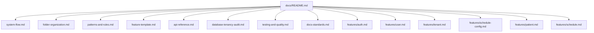

# Mindflow API Documentation

This directory is the canonical project documentation for architecture, implementation standards, and feature behavior.

## Documentation Contract

1. All persistent project documentation must live under `docs/`.
2. Every Markdown document in `docs/` must include at least one Mermaid diagram.
3. Any code change that modifies behavior must also update relevant docs.
4. New features must include or update feature docs in `docs/features/`.

## Document Index

- [System Flow](./system-flow.md): runtime request lifecycle, middleware, and dependency flow.
- [Folder Organization](./folder-organization.md): folder ownership and file responsibilities.
- [Patterns and Rules](./patterns-and-rules.md): architecture rules, anti-duplication policy, and done checklist.
- [Feature Template](./feature-template.md): canonical scaffolding process and file templates.
- [API Reference](./api-reference.md): endpoint map and auth/tenant requirements.
- [Database, Tenancy, and Audit](./database-tenancy-audit.md): persistence model, tenant context, audit logging, and migration rules.
- [Testing and Quality](./testing-and-quality.md): fixture strategy, test requirements, and quality gates.
- [Documentation Standards](./docs-standards.md): mandatory docs format and Mermaid usage.
- [Auth Feature](./features/auth.md)
- [User Feature](./features/user.md)
- [Tenant Feature](./features/tenant.md)
- [Schedule Config Feature](./features/schedule-config.md)
- [Patient Feature](./features/patient.md)
- [Schedule Feature](./features/schedule.md)
