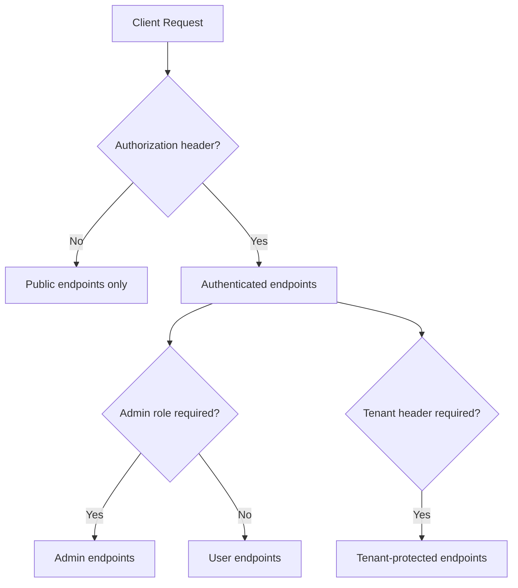

# API Reference

All API routes are currently exposed under `settings.api_prefix` (default `/api`).

## Health and Root

- `GET /` -> service status message.
- `GET /health` -> health check.

## Authentication (`/api/auth`)

- `POST /login`
- `POST /refresh`
- `POST /logout` (authenticated)

## Users (`/api/users`)

Authenticated (self):

- `GET /me`
- `PUT /me`
- `POST /me/change-password`

Admin-only:

- `POST /`
- `GET /`
- `GET /{user_id}`
- `PUT /{user_id}`
- `POST /{user_id}/roles`
- `POST /{user_id}/permissions`
- `POST /{user_id}/tenants`
- `DELETE /{user_id}`

## Tenants (`/api/tenants`)

Admin-only:

- `POST /`
- `GET /`
- `GET /{tenant_id}`
- `PUT /{tenant_id}`
- `DELETE /{tenant_id}` (soft deactivation)

## Schedule Configurations (`/api/schedule-configurations`)

Authenticated + tenant header required (`X-Tenant-ID`):

- Scope: tenant-wide shared configuration (single config per tenant; assistants and tenant owners use the same record).
- Authorization: user must be assigned to requested tenant (`tenant_id` present in `current_user.tenant_ids`).

- `POST /`
- `GET /`
- `GET /{configuration_id}`
- `PUT /{configuration_id}`
- `DELETE /{configuration_id}`

## Schedule (`/api/schedule`)

Authenticated + tenant header required (`X-Tenant-ID`):

- Scope: tenant-scoped consultation scheduling lifecycle and calendar views.
- Authorization: user must be assigned to requested tenant and have `TENANT_OWNER` or `ASSISTANT` role.
- Rules: requires tenant schedule configuration + active patient; blocks occupied slots and past datetimes.

- `POST /appointments`
- `GET /appointments`
- `GET /appointments/{appointment_id}`
- `PUT /appointments/{appointment_id}`
- `PATCH /appointments/{appointment_id}/status`
- `PATCH /appointments/{appointment_id}/payment-status`
- `DELETE /appointments/{appointment_id}`
- `GET /defaults`
- `GET /availability`

## Patients (`/api/patients`)

Authenticated + tenant header required (`X-Tenant-ID`):

- Scope: tenant-scoped patient registry with full and quick registration modes.
- Authorization: user must be assigned to requested tenant and have `TENANT_OWNER` role.
- Lifecycle: inactivation is soft-delete behavior with retention metadata.

- `POST /`
- `POST /quick-register`
- `GET /`
- `GET /{patient_id}`
- `PUT /{patient_id}`
- `POST /{patient_id}/complete-registration`
- `PATCH /{patient_id}/profile-photo`
- `DELETE /{patient_id}`
- `POST /{patient_id}/reactivate`

## Documentation Endpoints

- `/docs`
- `/redoc`
- `/openapi.json`

In non-development environments, these are guarded by `admin_docs_middleware`.
