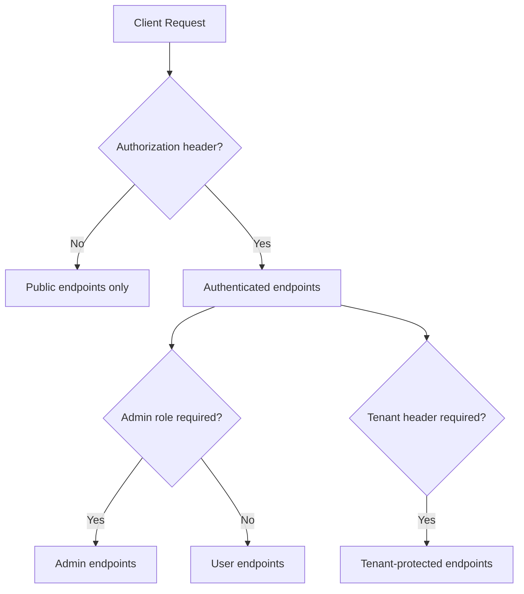

# API Reference

All API routes are currently exposed under `settings.api_prefix` (default `/api`).

## Health and Root

- `GET /` -> service status message.
- `GET /health` -> health check.

## Authentication (`/api/auth`)

- `POST /login`
- `POST /refresh`
- `POST /logout` (authenticated)

## Users (`/api/users`)

Authenticated (self):

- `GET /me`
- `PUT /me`
- `POST /me/change-password`

Admin-only:

- `POST /`
- `GET /`
- `GET /{user_id}`
- `PUT /{user_id}`
- `POST /{user_id}/roles`
- `POST /{user_id}/permissions`
- `POST /{user_id}/tenants`
- `DELETE /{user_id}`

## Tenants (`/api/tenants`)

Admin-only:

- `POST /`
- `GET /`
- `GET /{tenant_id}`
- `PUT /{tenant_id}`
- `DELETE /{tenant_id}` (soft deactivation)

## Schedule Configurations (`/api/schedule-configurations`)

Authenticated + tenant header required (`X-Tenant-ID`):

- `POST /`
- `GET /`
- `GET /{configuration_id}`
- `PUT /{configuration_id}`
- `DELETE /{configuration_id}`

## Documentation Endpoints

- `/docs`
- `/redoc`
- `/openapi.json`

In non-development environments, these are guarded by `admin_docs_middleware`.
