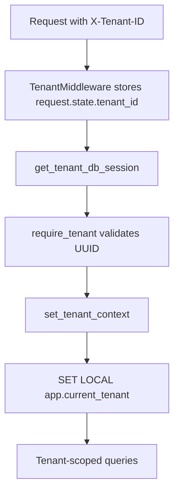

# Database, Tenancy, and Audit

## Base Layer

- `Base`: SQLAlchemy declarative base.
- `TimestampMixin`: `created_at`, `updated_at` with timezone-aware UTC defaults.
- `TenantMixin`: adds indexed `tenant_id` for tenant-scoped tables.

## Session Dependencies

- `get_db_session()` for global data.
- `get_tenant_db_session(request)` for tenant-scoped data and tenant session context.

## Audit Logging

- `AuditableMixin` triggers SQLAlchemy events (`after_insert`, `after_update`, `after_delete`).
- Audit entries are stored in `audit_logs` with `before`, `after`, and computed `diff` payloads.
- `AuditContextMiddleware` sets current user context for audit attribution.

## Current Migration Chain

1. `0001_users`
2. `0002_auth`
3. `0003_audit`
4. `0004_tenants`
5. `0005_schedule_config`
6. `0006_schedule_config_tenant_unique`

## Migration Rules

- Every schema change requires a migration file.
- `alembic/env.py` must import all model modules used by metadata autogeneration.
- Keep upgrade/downgrade paths coherent.

## Alembic Coverage

- `alembic/env.py` should import all active model modules, including `schedule_config`, to keep autogenerate metadata complete.
