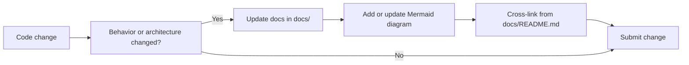

# Documentation Standards

This project treats documentation as part of the deliverable, not an optional artifact.



## Mandatory Rules

1. Documentation files live under `docs/`.
2. Every `docs/*.md` file must include at least one Mermaid diagram.
3. New features require:
- feature docs under `docs/features/`
- API map updates in `docs/api-reference.md`
- architecture or persistence updates if applicable

4. Significant behavior changes must update:
- `docs/system-flow.md` if runtime flow changed
- `docs/database-tenancy-audit.md` if persistence/tenancy/audit changed
- `docs/testing-and-quality.md` if testing strategy changed

## Recommended Page Skeleton

```markdown
# <Title>

## Context

## Current Behavior

## Rules/Constraints

## Operational Checklist


```

## Review Checklist for Documentation PRs

- Diagram present and renders in Mermaid.
- Terminology matches code (`tenant`, `session`, `router`, `service`).
- Paths and module names are valid.
- Cross-links are not broken.
