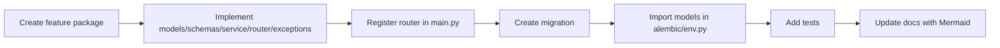

# Feature Template

Use this as the canonical process for adding new features.



## Step-by-Step

1. Create `src/features/<feature>/` with:
- `__init__.py`
- `models.py`
- `schemas.py`
- `service.py`
- `router.py`
- `exceptions.py`

2. Choose scope:
- global table: `Base` (+ optional `TimestampMixin`, `AuditableMixin`)
- tenant table: include `TenantMixin`, use `get_tenant_db_session`

3. Keep file responsibilities strict:
- schema validation in `schemas.py`
- business and query logic in `service.py`
- HTTP I/O and commit boundaries in `router.py`

4. Register router in `src/main.py`:
- public routers list if no tenant header required
- tenant routers list if `X-Tenant-ID` is required

5. Schema changes:
- add migration in `alembic/versions/`
- ensure imports in `alembic/env.py`

6. Add tests under `tests/features/<feature>/`.

7. Add/update docs under `docs/` and include Mermaid diagrams.

## Minimal File Templates

### `models.py`

```python
"""<Feature> domain models."""

from sqlalchemy.orm import Mapped, mapped_column

from src.database.base import Base, TimestampMixin
from src.shared.audit.audit import AuditableMixin


class ExampleEntity(Base, TimestampMixin, AuditableMixin):
    __tablename__ = "example_entities"

    id: Mapped[int] = mapped_column(primary_key=True, autoincrement=True)
```

### `schemas.py`

```python
"""<Feature> schemas."""

from pydantic import BaseModel


class ExampleCreateRequest(BaseModel):
    name: str


class ExampleResponse(BaseModel):
    id: int
    name: str

    model_config = {"from_attributes": True}
```

### `service.py`

```python
"""<Feature> service layer."""

from sqlalchemy.ext.asyncio import AsyncSession


class ExampleService:
    @staticmethod
    async def create(session: AsyncSession, data):
        ...
```

### `router.py`

```python
"""<Feature> router."""

from fastapi import APIRouter, Depends
from sqlalchemy.ext.asyncio import AsyncSession

from src.database.dependencies import get_db_session

router = APIRouter(prefix="/examples", tags=["Examples"])


@router.post("")
async def create_example(data, session: AsyncSession = Depends(get_db_session)):
    ...
    await session.commit()
```

### `exceptions.py`

```python
"""<Feature> exceptions."""

from fastapi import HTTPException, status


class ExampleNotFound(HTTPException):
    def __init__(self):
        super().__init__(status_code=status.HTTP_404_NOT_FOUND, detail="Example not found")
```
