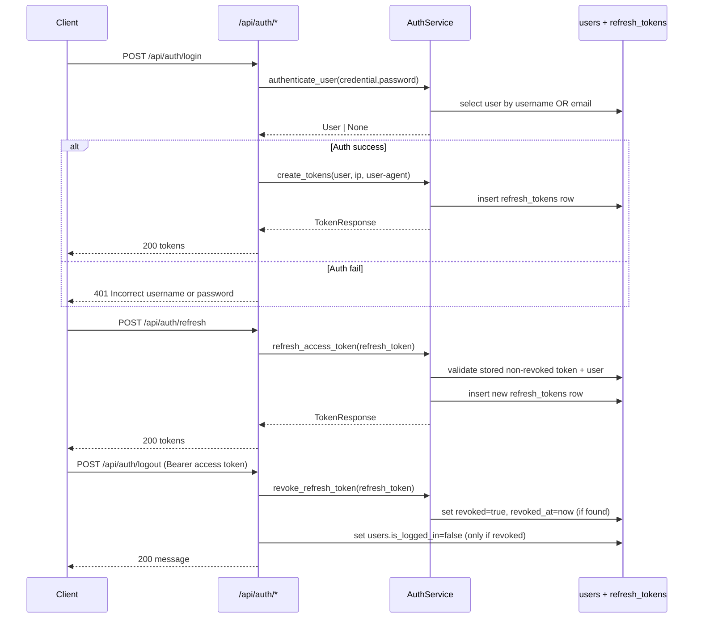
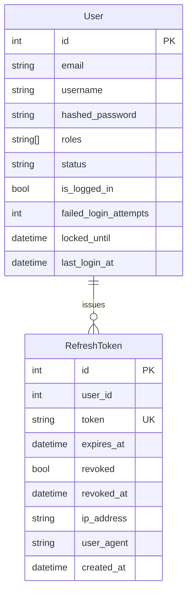

# Auth Feature

## Purpose

`src/features/auth` provides JWT-based authentication, refresh-token persistence/revocation, and reusable authorization dependencies used by protected routes.

## Scope

Documented feature files:

- `src/features/auth/router.py`
- `src/features/auth/service.py`
- `src/features/auth/schemas.py`
- `src/features/auth/models.py`
- `src/features/auth/exceptions.py`
- `src/features/auth/dependencies.py`
- `src/features/auth/jwt_utils.py`

Direct dependencies used by this feature:

- `src/features/user/models.py` (`User`, `UserStatus`, `UserRole`)
- `src/shared/validators/password.py` (password strength validator)
- `src/database/dependencies.py` and `src/database/client.py` (global DB session + transaction behavior)
- `src/shared/audit/audit.py` (`set_current_user`, audit side effects)
- `src/shared/tenancy/dependencies.py` (`require_tenant`, used by `require_tenant_membership`)

## Request Flow

## Data Model

## Schemas And Validation

### `UserLoginRequest`

- `username`: optional string, length `3..50`, regex `^[a-zA-Z0-9._-]+$`
- `email`: optional valid email
- `password`: required string, min length `8`, must include uppercase + lowercase + digit
- cross-field rule: at least one of `username` or `email` is required
- `credential` property returns `username` when both are sent, otherwise `email`

### `RefreshTokenRequest`

- `refresh_token`: required string

### `TokenResponse`

- `access_token: str`
- `refresh_token: str`
- `token_type: str` (default `bearer`)
- `expires_in: int` (seconds)

## Access Rules

- `POST /api/auth/login` and `POST /api/auth/refresh` are public endpoints.
- `POST /api/auth/logout` requires `get_current_active_user`:
  - valid bearer access token
  - authenticated user must be active and unlocked

## Endpoints

Base path is `/api/auth`.

### `POST /api/auth/login`

Authenticates by `username` or `email` plus password.

Request body (`UserLoginRequest`):

- `username`: optional string, length `3..50`, regex `^[a-zA-Z0-9._-]+$`
- `email`: optional valid email
- `password`: required string, min length `8`, must include uppercase, lowercase, and digit
- cross-field rule: at least one of `username` or `email` is required
- credential precedence: if both are sent, service uses `username` (via `credential` property)

Success response `200` (`TokenResponse`):

- `access_token`: JWT access token
- `refresh_token`: JWT refresh token
- `token_type`: always `bearer`
- `expires_in`: access-token lifetime in seconds (`access_token_expire_minutes * 60`)

Error responses:

- `401` `Incorrect username or password` for unknown user, wrong password, inactive user, or locked user
- `422` request validation errors

### `POST /api/auth/refresh`

Issues a new access token and a new refresh token.

Request body (`RefreshTokenRequest`):

- `refresh_token`: required string

Success response `200` (`TokenResponse`):

- same shape as login response

Validation/service checks:

- JWT must decode correctly
- token claim `type` must be `refresh`
- token payload must contain `sub`
- matching row must exist in `refresh_tokens` with `revoked=false`
- `refresh_tokens.expires_at` must be in the future
- associated user must exist and be active

Error responses:

- `401` `Invalid or expired refresh token`
- `401` `Invalid token type, expected refresh`
- `401` `Invalid token payload`
- `401` `Refresh token not found or revoked`
- `401` `Refresh token expired`
- `401` `User not found or inactive`

Implementation behavior:

- old refresh token is not automatically revoked on refresh
- multiple valid refresh tokens can coexist until revoked or expired

### `POST /api/auth/logout`

Revokes a specific refresh token. Requires a valid bearer access token.

Request headers:

- `Authorization: Bearer <access_token>`

Request body (`RefreshTokenRequest`):

- `refresh_token`: required string

Success responses (`200`):

- `{"message": "Successfully logged out"}` when token existed and was newly revoked
- `{"message": "Token already revoked or not found"}` when token did not exist or was already revoked

Error responses:

- `401` not authenticated / invalid access token
- `403` `User account is inactive`
- `403` `User account is locked`
- `422` request validation errors

## Service Logic

### `AuthService.authenticate_user(session, credential, password)`

- Loads user where `username == credential OR email == credential`
- Returns `None` if user not found
- If `status=locked` but `locked_until` is already in the past, restores account to active before auth checks
- Returns `None` if account is currently locked (`locked_until > now`)
- Returns `None` if user is inactive
- Wrong password:
  - increments `failed_login_attempts`
  - if attempts reach `>= 5`, sets `locked_until = now + 30 minutes` and `status = locked`
  - returns `None`
- Correct password:
  - resets `failed_login_attempts = 0`
  - sets `last_login_at = now`
  - clears `locked_until`
  - sets `is_logged_in = True`
  - returns user

### `AuthService.create_tokens(session, user, ip_address, user_agent)`

- Creates access token claims:
  - `sub` (user id as string)
  - `username`
  - `roles`
  - `iat`, `exp`, `type=access`
- Creates refresh token claims:
  - `sub`
  - `iat`, `exp`, `type=refresh`
- Inserts `refresh_tokens` row with:
  - `user_id`, `token`, `expires_at = now + 7 days`, `ip_address`, `user_agent`
- Returns `TokenResponse`

### `AuthService.refresh_access_token(session, refresh_token)`

- Decodes JWT and validates refresh-type payload
- Loads non-revoked stored refresh token row by token string
- Verifies DB expiry (`expires_at`)
- Loads user by `stored_token.user_id` and verifies active status
- Calls `create_tokens(...)` to issue a new token pair

### `AuthService.revoke_refresh_token(session, refresh_token)`

- Loads refresh token row by token string
- If found and not revoked:
  - sets `revoked = True`
  - sets `revoked_at = now`
  - returns `True`
- Else returns `False`

### `AuthService.revoke_all_user_tokens(session, user_id)`

- Loads all non-revoked `refresh_tokens` rows for `user_id`
- Sets `revoked = True` and `revoked_at = now` for each active token
- Returns the number of revoked tokens

## Authorization Dependencies (Auth Feature Exports)

### `get_current_user`

- Expects bearer access token
- Decodes token, requires `type=access`, requires `sub`
- Loads user by `sub`
- If `status=locked` but `locked_until` already expired, restores account to active
- Rejects inactive and currently locked users
- Calls `set_current_user(user)` for audit context

Possible errors:

- `401` invalid/expired token, wrong token type, invalid payload, user not found
- `403` inactive user or locked user

### `get_current_active_user`

- Wrapper returning `get_current_user` result

### `get_optional_user`

- Returns `None` when no bearer token is provided
- Reuses `get_current_user` with the same DB session when credentials are present
- Returns `None` for invalid token, inactive user, or currently locked user

### `require_role(*roles)`

- Admin bypass (`admin` role passes any role check)
- For non-admin users, requires ANY one of provided roles
- Error: `403` with required role list

### `require_permission(*permissions)`

- Admin bypass
- For non-admin users, requires ANY one of provided permissions
- Error: `403` with required permission list

### `require_tenant_membership`

- Depends on `require_tenant` (requires valid `X-Tenant-ID`)
- Ensures authenticated user has requested tenant in `user.tenant_ids`
- Errors:
  - `400` tenant header missing/invalid
  - `403` user not assigned to requested tenant

## Error Handling

Feature exceptions (`src/features/auth/exceptions.py`):

- `InvalidCredentialsException` -> `401` (`Incorrect username or password`)
- `InvalidTokenException` -> `401`
- `InvalidTokenTypeException` -> `401`
- `InvalidTokenPayloadException` -> `401`
- `RefreshTokenNotFoundException` -> `401`
- `RefreshTokenExpiredException` -> `401`
- `UserInactiveException` -> `403`
- `UserLockedException` -> `403`
- `InsufficientRoleException` -> `403`
- `InsufficientPermissionException` -> `403`
- `InsufficientPermissionsException` -> `403`

## Side Effects

- Login success:
  - updates `users` login-related fields
  - inserts one `refresh_tokens` row
- Refresh success:
  - inserts one additional `refresh_tokens` row
- Logout success (revocation happened):
  - updates `refresh_tokens.revoked` and `revoked_at`
  - updates `users.is_logged_in = false`
- User deactivation flow (from user feature):
  - calls `AuthService.revoke_all_user_tokens(...)`
  - revokes every active refresh token for that user
- Logout with already-revoked or unknown refresh token:
  - returns `200` but does not update `users.is_logged_in`

Audit effects (`AuditableMixin`):

- `RefreshToken` and `User` changes generate audit rows automatically
- `user_id` in audit context is set when `get_current_user` runs (for authenticated flows)

Transaction behavior:

- login/refresh and successful logout-revocation paths call `session.commit()` explicitly
- session dependencies also commit on successful request and roll back on unhandled exceptions
- failed login attempts that end with `InvalidCredentialsException` are rolled back

## Frontend Integration Notes

- Store and send `access_token` as bearer token for protected endpoints.
- Persist `refresh_token` and call `/api/auth/refresh` before/after access-token expiry.
- After refresh, update stored token pair; previous refresh token may still remain valid server-side.
- Treat both logout `200` messages as terminal success from UI perspective.
- Surface login failure as generic credential failure (`401`) because server intentionally does not disclose whether account exists/locked/inactive in login endpoint responses.
