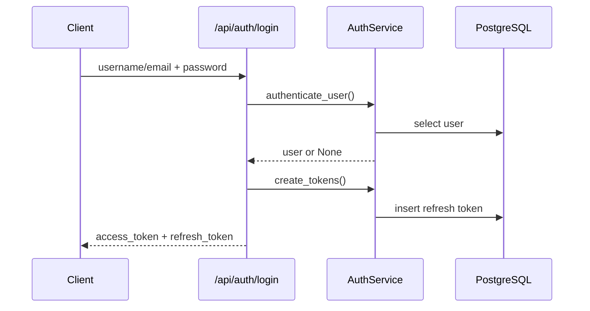

# Auth Feature

## Purpose

`src/features/auth` implements login, token issuance, refresh, logout, and authorization dependencies.

## Files

- `models.py`: `RefreshToken` model.
- `schemas.py`: login/refresh request and token response schemas.
- `service.py`: authentication and token lifecycle logic.
- `router.py`: `/login`, `/refresh`, `/logout` endpoints.
- `jwt_utils.py`: JWT encode/decode helpers.
- `dependencies.py`: `get_current_user`, role and permission requirement factories.
- `exceptions.py`: auth-specific HTTP exceptions.

## Core Rules

- Access tokens include `sub`, `username`, and `roles`.
- Refresh token records are persisted in `refresh_tokens`.
- Inactive or locked users cannot authenticate.
- Refresh token flow validates token type and revoked/expiration state.
- Logout revokes refresh token and marks user as not logged in when applicable.

## Endpoints

- `POST /api/auth/login`
- `POST /api/auth/refresh`
- `POST /api/auth/logout` (requires bearer access token)

## Test Coverage

- service-level auth flow tests
- endpoint login/refresh/logout tests
- dependency behavior (`get_current_user`) tests
