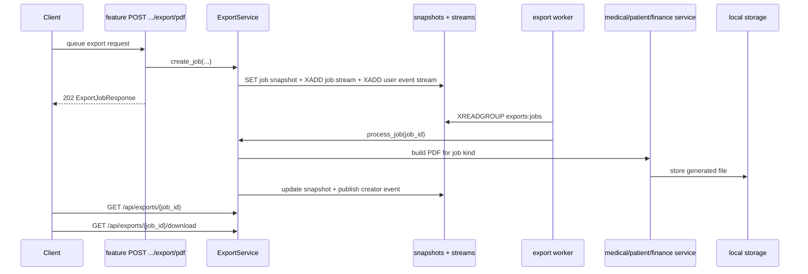
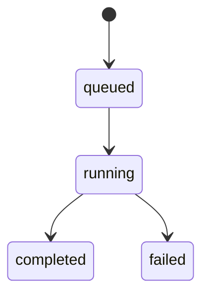

# Export Feature

## Purpose

`src/features/export` manages creator-scoped async export jobs for medical records, patients, and finance reports. It stores job state in Redis, exposes generic progress/download endpoints, and streams status changes to the frontend with SSE.

## Scope

Documented feature files:

- `src/features/export/router.py`
- `src/features/export/service.py`
- `src/features/export/schemas.py`
- `src/features/export/runtime.py`

Direct dependencies used by this feature:

- `src/features/auth/dependencies.py` (`require_tenant_membership`)
- `src/features/medical_record/service.py` (medical record PDF generation)
- `src/features/patient/service.py` (patient dossier PDF generation)
- `src/features/finance/service.py` (finance report PDF generation)
- `src/shared/redis/client.py` (Redis client, streams, JSON helpers)
- `src/shared/storage/backends.py` (stored file resolution)
- `src/config/settings.py` (worker block/claim/SSE timing settings)

## Request Flow

## Data Model

Runtime state is Redis-backed, not database-backed.

Keys and structures:

- `exports:jobs`: Redis stream used as the worker queue
- `exports:workers`: consumer group used by background workers
- `exports:job:{job_id}`: JSON snapshot for one job
- `exports:user:{tenant_id}:{user_id}:events`: Redis stream used by the SSE endpoint for creator-scoped updates

Stored file bytes remain on local storage. Redis stores only metadata such as `file_relative_path`, `filename`, and `content_type`.

## Schemas And Validation

### `ExportJobKind`

- `medical_record_single_pdf`
- `medical_record_patient_history_pdf`
- `medical_record_all_pdf`
- `patient_complete_pdf`
- `finance_report_pdf`

### `ExportJobStatus`

- `queued`
- `running`
- `completed`
- `failed`

### `ExportJobResponse`

Public response fields:

- `id`
- `kind`
- `status`
- `progress_current`
- `progress_total`
- `progress_message`
- `download_url`
- `error_detail`
- `created_at`
- `updated_at`

### `FinanceReportExportRequest`

Used by `POST /api/finance/report/export/pdf`:

- `view`: `day|week|month|year|total|custom`, default `day`
- `reference_date`: optional date for non-custom windows
- `start_date`, `end_date`: optional dates validated by the finance service for `custom`

Validation behavior:

- generic export endpoints are creator-scoped and tenant-scoped; a job created by another user is returned as `404`
- download is allowed only when job status is `completed`
- feature-specific initiation endpoints perform synchronous existence/range checks before queueing

## Endpoints

Base path is `/api/exports`.

### `GET /api/exports/events`

Opens a server-sent events stream for the authenticated user in the current tenant.

Behavior:

- media type is `text/event-stream`
- emits `event: export.updated`
- `data:` contains the JSON-serialized `ExportJobResponse`
- sends keepalive comments when no export update is available
- only receives events for jobs created by the current user in the current tenant

Success:

- `200` streaming SSE response

Errors:

- `400`/`401`/`403` tenant or auth failures

### `GET /api/exports/{job_id}`

Returns the latest snapshot for one export job.

Success:

- `200` `ExportJobResponse`

Errors:

- `404` job does not exist or does not belong to the current user in the current tenant

### `GET /api/exports/{job_id}/download`

Downloads the finished export file.

Behavior:

- resolves the file from the stored relative path under `storage/`
- returns the feature-owned filename and content type

Success:

- `200` file response

Errors:

- `404` job does not exist, is not creator-scoped to the current user, or file metadata/path is missing
- `409` job has not completed yet

## Service Logic

`ExportService` centralizes:

- `create_job(...)`: creates the initial `queued` snapshot and enqueues the job in Redis
- `get_job_for_user(...)`: enforces tenant + creator scoping for status reads
- `get_download_file(...)`: enforces tenant + creator scoping for downloads and resolves local storage metadata
- `update_snapshot(...)`: persists progress/status updates and appends creator-scoped SSE events
- `_build_export_file(...)`: dispatches the job to the correct feature service based on `ExportJobKind`
- `process_job(...)`: moves one job through `running` to `completed` or `failed`
- `consume_one_batch(...)`: claims stale jobs with `XAUTOCLAIM`, reads new jobs with `XREADGROUP`, processes them, and acknowledges stream entries
- `run_worker_loop()`: long-running worker loop started from app lifespan

Worker/runtime behavior:

- export worker startup is controlled by `EXPORT_WORKER_ENABLED`
- worker blocking is controlled by `EXPORT_WORKER_BLOCK_MS`
- stale pending messages are reclaimed with `EXPORT_WORKER_CLAIM_IDLE_MS`
- SSE keepalive interval is controlled by `EXPORT_SSE_KEEPALIVE_SECONDS`

## Error Handling

Feature-level HTTP errors:

- `404` `Export job not found`
- `404` `Export file not found`
- `409` `Export job is not completed yet`
- `409` `Export file metadata is incomplete`

Runtime behavior:

- job execution failures do not remove the job snapshot
- failed jobs remain queryable with `status=failed` and `error_detail`
- feature-specific validation errors raised during job execution are surfaced as failed-job details

## Side Effects

- job state is written to Redis snapshots and streams
- completed files are persisted to local storage under the owning feature path:
  - `storage/medical-records/exports/<tenant-id>/...`
  - `storage/patients/exports/<tenant-id>/...`
  - `storage/finance/exports/<tenant-id>/...`
- app lifespan starts the export worker only when `EXPORT_WORKER_ENABLED=true` and `TESTING=false`

## Frontend Integration Notes

- Export creation does not happen under `/api/exports`; it starts from feature-specific `POST .../export/pdf` routes.
- Store the returned `job_id` and subscribe to `/api/exports/events` for live status changes.
- Polling `/api/exports/{job_id}` is still valid when SSE is unavailable.
- Use `download_url` only after the job reaches `completed`.
