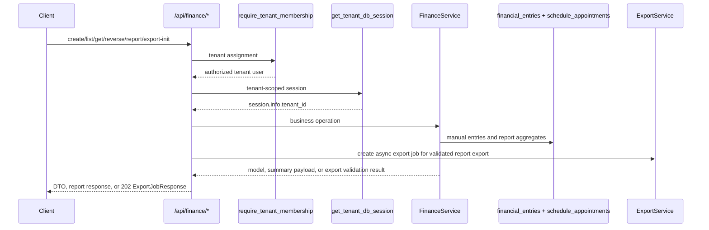
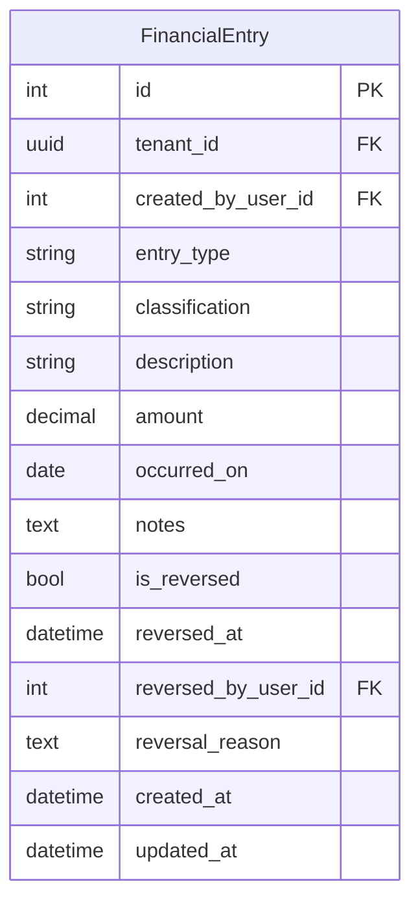

# Finance Feature

## Purpose

`src/features/finance` manages tenant-scoped financial reporting and manual financial entries. It combines automatic consultation revenue derived from paid appointments with manually entered income and expense records, and it can queue async PDF exports of the finance report.

## Scope

Documented feature files:

- `src/features/finance/router.py`
- `src/features/finance/service.py`
- `src/features/finance/schemas.py`
- `src/features/finance/models.py`
- `src/features/finance/exceptions.py`
- `src/features/finance/storage.py`

Direct dependencies used by this feature:

- `src/features/auth/dependencies.py` (`require_tenant_membership`)
- `src/database/dependencies.py` (`get_tenant_db_session`)
- `src/features/export/service.py` (async export job creation)
- `src/features/export/schemas.py` (`ExportJobKind`, `ExportJobResponse`, `FinanceReportExportRequest`)
- `src/features/schedule/models.py` (`ScheduleAppointment` for automatic consultation revenue)
- `src/features/schedule/schemas.py` (`PaymentStatus`)
- `src/shared/pagination/pagination.py` (`PaginationParams`)
- `src/shared/audit/audit.py` (`AuditableMixin`)

## Request Flow

## Data Model

`financial_entries` is tenant-scoped (`TenantMixin`) and auditable (`AuditableMixin`).

Automatic consultation revenue is not stored in this table. It is computed from `schedule_appointments` rows where:

- `payment_status = paid`
- `is_deleted = false`
- `paid_at IS NOT NULL`

## Schemas And Validation

### Enums

- `FinancialEntryType`: `income`, `expense`
- `FinancialEntryClassification`: `fixed`, `variable`
- `FinanceReportView`: `day`, `week`, `month`, `year`, `total`, `custom`

### `FinancialEntryCreateRequest`

- `entry_type`: required enum
- `classification`: required enum
- `description`: required trimmed non-blank string, max 255
- `amount`: required decimal `> 0`, max digits 10, scale 2
- `occurred_on`: required date
- `notes`: optional trimmed non-blank string when provided, max 5000

### `FinancialEntryReverseRequest`

- `reversal_reason`: required trimmed non-blank string, min 3, max 500

### Response DTOs

- `FinancialEntryResponse`: full manual entry state including reversal metadata
- `FinancialEntryListResponse`: paginated list envelope
- `FinanceReportResponse`: aggregated totals and counts for the selected report window
- `ExportJobResponse`: async export job envelope returned by the PDF export route

## Endpoints

Base path is `/api/finance`.

### `POST /api/finance/entries`

Creates one manual financial entry.

Behavior:

- stores `created_by_user_id` from current authenticated user
- entries are append-only in v1
- returns the created entry immediately after commit and refresh
- the response includes `is_reversed=false` and null reversal metadata on creation

Success:

- `200` `FinancialEntryResponse`

Errors:

- `401` invalid or missing bearer token
- `403` authenticated user is not assigned to the tenant
- `422` request validation errors

### `GET /api/finance/entries`

Lists manual financial entries.

Query params:

- `page`, `page_size`
- `entry_type`
- `classification`
- `start_date`, `end_date`
- `include_reversed` (default `false`)

Ordering:

- `occurred_on DESC, id DESC`

Behavior:

- when `include_reversed=false`, reversed entries are excluded
- when both dates are provided, `end_date` must be greater than or equal to `start_date`
- when only one date is provided, the service applies that side of the range without requiring the other bound
- pagination can be disabled by sending both `page=None` and `page_size=None`

Success:

- `200` `FinancialEntryListResponse`

Errors:

- `400` invalid date window
- `401` invalid or missing bearer token
- `403` authenticated user is not assigned to the tenant
- `422` query validation errors

### `GET /api/finance/entries/{entry_id}`

Returns one manual financial entry by id.

Behavior:

- lookup is tenant-scoped
- `404` is returned when the id does not exist in the current tenant

Success:

- `200` `FinancialEntryResponse`

Errors:

- `401` invalid or missing bearer token
- `403` authenticated user is not assigned to the tenant
- `404` entry not found in the current tenant

### `POST /api/finance/entries/{entry_id}/reverse`

Reverses one manual financial entry.

Behavior:

- sets `is_reversed=true`
- stores `reversed_at`, `reversed_by_user_id`, and `reversal_reason`
- rejects already reversed rows with `409`
- the request does not delete the row; it only marks the original entry as reversed

Success:

- `200` `FinancialEntryResponse`

Errors:

- `401` invalid or missing bearer token
- `403` authenticated user is not assigned to the tenant
- `404` entry not found in the current tenant
- `409` entry was already reversed
- `422` request validation errors

### `GET /api/finance/report`

Returns an aggregated finance summary.

Query params:

- `view`: `day|week|month|year|total|custom` (default `day`)
- `reference_date`: optional date used for `day|week|month|year`
- `start_date`, `end_date`: required only when `view=custom`

Report semantics:

- automatic income uses `schedule_appointments.paid_at`
- manual entries use `financial_entries.occurred_on`
- `custom` is inclusive on both dates
- `total` ignores date filters and returns `range_start=null`, `range_end=null`
- `day`, `week`, `month`, and `year` fall back to the current UTC date when `reference_date` is omitted
- reversed manual entries are excluded from the totals

Success:

- `200` `FinanceReportResponse`

Errors:

- `400` custom view missing dates or invalid date order
- `401` invalid or missing bearer token
- `403` authenticated user is not assigned to the tenant
- `422` query validation errors

Response totals:

- `automatic_income_total`
- `manual_income_total`
- `manual_expense_total`
- `total_income`
- `total_expense`
- `net_total`
- `paid_appointments_count`
- `manual_income_count`
- `manual_expense_count`

### `POST /api/finance/report/export/pdf`

Queues a finance report PDF export.

Request body:

- `view`: `day|week|month|year|total|custom`, default `day`
- `reference_date`: optional
- `start_date`, `end_date`: optional, but `custom` still requires both dates through finance service validation

Behavior:

- validates the requested report window by calling the same report builder used by `GET /api/finance/report`
- creates an async export job with kind `finance_report_pdf`
- final PDF includes summary totals, non-reversed manual entries, and paid non-deleted appointments for the resolved range
- the response is the generic export job envelope, not a finance-specific file download response
- the generated file is retrieved later from the shared export endpoints, not from the finance route itself

Success:

- `202` `ExportJobResponse`

Errors:

- `400` invalid custom range
- `400` custom range missing dates
- `400`/`401`/`403` access, tenant, or auth failures
- `422` request validation

## Service Logic

`FinanceService` centralizes:

- tenant context validation (`session.info["tenant_id"]`)
- manual entry creation, lookup, listing, and reversal
- date-range resolution for `day|week|month|year|total|custom`
- aggregate report computation across:
  - `financial_entries` for manual income/expenses
  - `schedule_appointments` for automatic paid consultation revenue
- PDF export generation through `export_report_pdf(...)`

Reporting rules:

- reversed manual entries are excluded from all report totals
- deleted appointments are excluded from automatic revenue
- appointment status does not affect revenue once payment status is `paid`
- automatic revenue amount uses the persisted appointment `charge_amount` snapshot
- exported manual-entry detail excludes reversed rows
- list and report queries operate strictly on the current tenant and fail fast if the tenant context is missing

## Error Handling

Feature exceptions:

- `FinancialEntryNotFound` -> `404`
- `FinancialEntryAlreadyReversed` -> `409`
- `FinanceCustomRangeRequired` -> `400`
- `FinanceInvalidCustomRange` -> `400`

Access and tenancy errors come from shared dependencies (`400/401/403`), and schema validation errors return `422`.

## Side Effects

- `POST /entries` and `POST /entries/{id}/reverse` commit at router boundary.
- `FinancialEntry` inherits `AuditableMixin`, so creation and reversal emit entries into `audit_logs`.
- Finance reports are read-only and do not materialize derived appointment revenue rows.
- finance export initiation validates the report window and enqueues a shared async export job.
- completed export files are stored under `storage/finance/exports/<tenant-id>/...`.

## Frontend Integration Notes

- Send `X-Tenant-ID` header and Bearer token for every finance endpoint.
- Access requires an authenticated user assigned to the requested tenant.
- Manual entry corrections in v1 require reversal plus a new replacement entry.
- Report windows use UTC calendar boundaries for appointment `paid_at` aggregation.
- Finance PDF export is async; after `POST /api/finance/report/export/pdf`, use the generic `/api/exports/*` endpoints for progress, SSE updates, and download.
