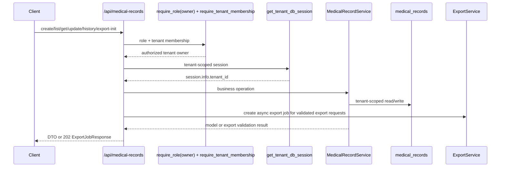
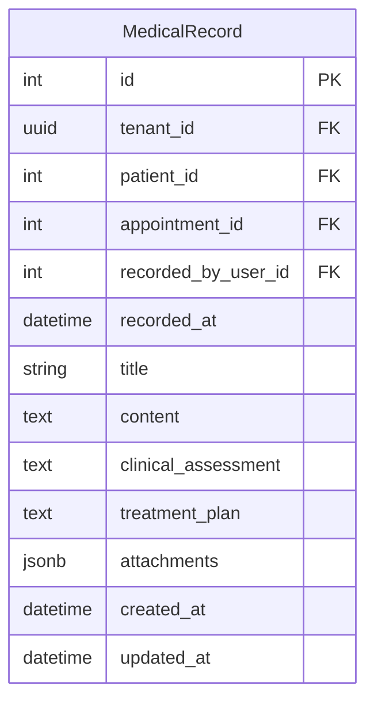

# Medical Record Feature

## Purpose

`src/features/medical_record` manages tenant-scoped digital medical records, including consultation note registration, patient history visualization, and async PDF export initiation for a single consultation, one patient history, or all patients in the tenant.

## Scope

Documented feature files:

- `src/features/medical_record/router.py`
- `src/features/medical_record/service.py`
- `src/features/medical_record/schemas.py`
- `src/features/medical_record/models.py`
- `src/features/medical_record/exceptions.py`

Direct dependencies used by this feature:

- `src/features/auth/dependencies.py` (`require_role`, `require_tenant_membership`)
- `src/database/dependencies.py` (`get_tenant_db_session`)
- `src/features/export/service.py` (async export job creation)
- `src/features/export/schemas.py` (`ExportJobKind`, `ExportJobResponse`)
- `src/features/patient/models.py` (`Patient` tenant validation)
- `src/features/schedule/models.py` (`ScheduleAppointment` optional linkage)
- `src/features/medical_record/storage.py` (attachment storage and export storage paths)
- `src/shared/storage/backends.py` (local storage backend abstraction)
- `src/shared/pdf/builder.py` (`build_pdf_from_template` via Jinja2 + WeasyPrint)
- `src/shared/pagination/pagination.py` (`PaginationParams`)

## Request Flow

## Data Model

`medical_records` is tenant-scoped (`TenantMixin`) and auditable (`AuditableMixin`).

## Schemas And Validation

### `MedicalRecordCreateRequest`

Required:

- `patient_id > 0`
- `content` (trimmed, non-blank, max 20000)

Optional:

- `appointment_id > 0`
- `recorded_at` (timezone-aware datetime)
- `title` (trimmed non-blank if provided, max 255)
- `clinical_assessment` (trimmed non-blank if provided, max 20000)
- `treatment_plan` (trimmed non-blank if provided, max 20000)
- `attachments` (list of strings, max 20, no duplicates — populated by the router from uploaded files; clients do not submit attachment paths directly via this schema)

### `MedicalRecordUpdateRequest`

All mutable fields are optional. Additional rules:

- if `recorded_at` is sent, it cannot be `null` and must be timezone-aware
- if `patient_id` is sent, it cannot be `null`
- if `content` is sent, it cannot be `null` and must be non-blank
- `attachments: null` clears attachments to an empty list

### Response DTOs

- `MedicalRecordResponse`: full medical record state
- `MedicalRecordListResponse`: paginated list envelope
- `MedicalRecordPatientHistoryResponse`: paginated patient history envelope

## Endpoints

Base path is `/api/medical-records`.

### `POST /api/medical-records`

Creates one medical record.

Behavior:

- validates patient exists in current tenant
- if `appointment_id` is provided, validates appointment exists in current tenant and belongs to the same patient
- sets `recorded_by_user_id` from current authenticated user
- `recorded_at` defaults to the current UTC timestamp when omitted
- `attachments` are stored as URL strings and duplicate URLs are rejected by the request schema
- `tenant_owner` is required by the router, and the request still requires `X-Tenant-ID` plus a bearer token
- if the appointment belongs to a different patient, the request fails with `409 Conflict`

### `GET /api/medical-records`

Lists tenant medical records.

Query params:

- `page`, `page_size`
- `patient_id`
- `appointment_id`
- `search`
- `start_date`, `end_date` (applied to `recorded_at::date`)

Ordering: `recorded_at DESC, id DESC`.

Behavior:

- search is applied across `title`, `content`, `clinical_assessment`, and `treatment_plan`
- `page=None` and `page_size=None` disable pagination through the shared pagination contract
- empty result sets are returned as a normal `200` response with `total=0`

### `GET /api/medical-records/patients/{patient_id}/history`

Returns paginated history of records for one patient.

Behavior:

- validates patient exists in tenant before listing
- uses the same ordering and pagination rules as the main list endpoint

### `GET /api/medical-records/{record_id}`

Returns one medical record by id.

Behavior:

- returns `404` when the id does not exist in the current tenant
- the same numeric id in another tenant is not visible here

### `PUT /api/medical-records/{record_id}`

Updates one medical record.

Content type: `multipart/form-data`.

Request fields:

- `data` (optional string, default `{}`): JSON-encoded object with the fields to update. Accepted keys: `patient_id`, `appointment_id`, `recorded_at`, `title`, `content`, `clinical_assessment`, `treatment_plan`. Omit a key to leave its value unchanged.
- `files` (optional list of files): when provided, all uploaded files replace the existing attachment list. Omit to leave existing attachments unchanged.

Behavior:

- `data` is parsed via `MedicalRecordUpdateRequest.model_validate_json(data)`
- each file in `files` is stored through `MedicalRecordStorage.store_attachment` under `medical-records/attachments/<tenant-id>/<record-id>/<uuid>_<filename>`
- attachment paths are stored as relative path strings in `medical_records.attachments`
- validates patient and appointment consistency on update
- if patient changes while appointment remains, appointment must still belong to the new patient
- when `data` sets `attachments: null` and no `files` are provided, the attachment list is cleared
- `patient_id` and `content` cannot be sent as null when they are included in the `data` payload
- `recorded_at`, when sent in `data`, must be timezone-aware
- any attempt to reuse an appointment with a different patient returns `409 Conflict`

Success:

- `200` `MedicalRecordResponse`

Errors:

- `404` record, patient, or appointment not found
- `409` patient/appointment mismatch
- `400`/`401`/`403` access errors
- `422` validation errors in `data` or path parameter

### `GET /api/medical-records/{record_id}/attachments/{index}`

Downloads or redirects to one attachment stored on the record.

Behavior:

- `index` is the zero-based position in the record's `attachments` list
- returns `404` when the index is out of bounds or the file is missing on disk
- for local storage: returns a direct binary file response (`FileResponse`) with MIME type inferred from the filename extension
- for S3-compatible storage: returns a `307` redirect to a presigned URL

Success:

- `200` binary file download
- `307` redirect to presigned S3 URL

Errors:

- `404` attachment index out of bounds or file not found on disk
- `400`/`401`/`403` access errors

### `POST /api/medical-records/{record_id}/export/pdf`

Queues a single-record PDF export.

Behavior:

- validates the medical record exists in the current tenant
- creates an async export job with kind `medical_record_single_pdf`
- returns generic export job metadata instead of the file bytes

Success:

- `202` `ExportJobResponse`

Errors:

- `404` record not found
- `400`/`401`/`403` access, tenant, or auth failures

### `POST /api/medical-records/patients/{patient_id}/export/pdf`

Queues a patient-history PDF export.

Behavior:

- validates the patient exists in the current tenant
- validates at least one medical record exists for that patient
- creates an async export job with kind `medical_record_patient_history_pdf`

Success:

- `202` `ExportJobResponse`

Errors:

- `404` patient not found
- `404` no medical records exist for that patient
- `400`/`401`/`403` access, tenant, or auth failures

### `POST /api/medical-records/export/pdf`

Queues an all-records PDF export.

Behavior:

- validates at least one medical record exists in the tenant
- creates an async export job with kind `medical_record_all_pdf`

Success:

- `202` `ExportJobResponse`

Errors:

- `404` no medical records exist in the tenant
- `400`/`401`/`403` access, tenant, or auth failures

## Service Logic

`MedicalRecordService` centralizes:

- tenant context validation (`session.info["tenant_id"]`)
- patient existence checks in tenant scope
- appointment existence checks in tenant scope (`is_deleted=false`)
- patient/appointment consistency rules
- listing filters (patient, appointment, search, date range)
- pagination follows the shared `PaginationParams` contract, with `page=None` and `page_size=None` disabling paging
- export pre-validation for single, patient-history, and all-record queue requests
- PDF generation via `build_pdf_from_template("medical_record_export.html", context)` (Jinja2 + WeasyPrint); template shows `patient_name` header when exporting a single patient, or per-record patient names when exporting all
- export persistence through a segregated storage adapter (`MedicalRecordStorage` -> shared storage backend)
- attachment storage via `MedicalRecordStorage.store_attachment`, which writes each file to `medical-records/attachments/<tenant-id>/<record-id>/<uuid>_<filename>`

## Error Handling

Feature exceptions:

- `MedicalRecordNotFound` -> `404`
- `MedicalRecordPatientNotFound` -> `404`
- `MedicalRecordAppointmentNotFound` -> `404`
- `MedicalRecordAppointmentPatientMismatch` -> `409`
- `MedicalRecordExportEmpty` -> `404`

Access and tenancy errors come from shared dependencies (`400/401/403`), and schema validation errors return `422`.

## Side Effects

- Write endpoints (`POST`, `PUT`) commit at router boundary.
- `MedicalRecord` inherits `AuditableMixin`, so create/update operations emit entries into `audit_logs` automatically.
- `PUT` with `files` writes binary attachments to disk before the DB commit; stored paths are relative strings written into `medical_records.attachments`.
- Export initiation endpoints are read-only from the database perspective, validate exportability, and enqueue a generic export job.
- Completed export PDFs are generated from an HTML template via WeasyPrint and stored under `storage/medical-records/exports/<tenant-id>/...` by the shared export worker.

## Frontend Integration Notes

- Send `X-Tenant-ID` header and Bearer token for every endpoint.
- Only `tenant_owner` role is allowed; `assistant` users receive `403`.
- `PUT /api/medical-records/{record_id}` uses `multipart/form-data`. Send the JSON update payload as the `data` form field (string) and optional binary files as `files`. Omit `files` to leave existing attachments unchanged.
- After upload, `attachments` on the response are relative path strings. Use `GET /api/medical-records/{record_id}/attachments/{index}` to retrieve each file; the response is a direct binary download or a `307` presigned redirect.
- Export initiation endpoints return `202 ExportJobResponse`; use `/api/exports/{job_id}`, `/api/exports/events`, and `/api/exports/{job_id}/download` for progress and file retrieval.
