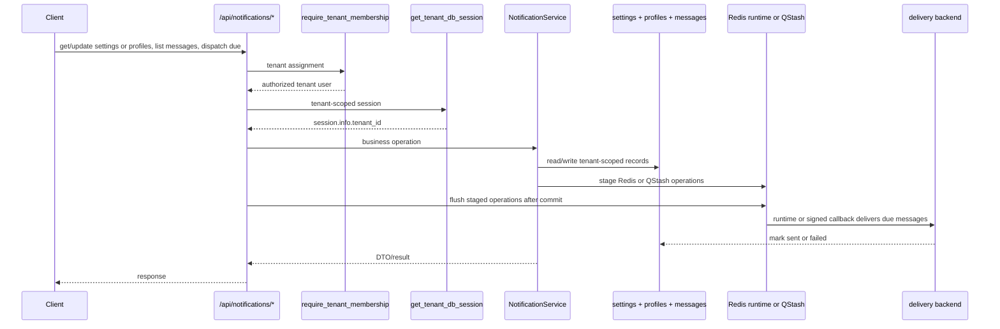
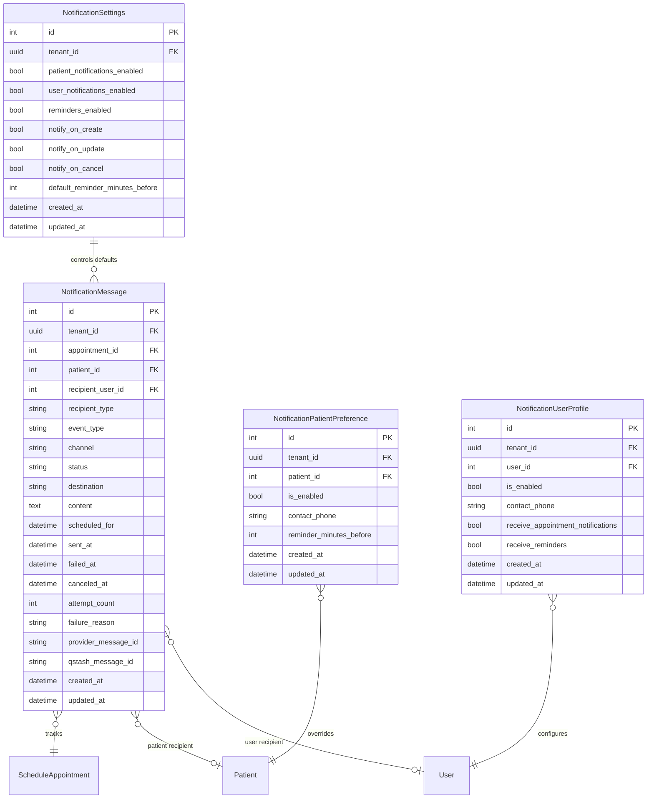

# Notification Feature

## Purpose

`src/features/notification` manages tenant-scoped notification settings, patient and user delivery configuration, notification message history/outbox, manual dispatch, and schedule-driven appointment notifications for confirmation, update, cancellation, and reminder events. Dispatch mode is controlled by `JOB_DISPATCH_MODE`: `redis_worker` uses the resident Redis scheduler and delivery loops, while `qstash` publishes signed callbacks for per-message delivery plus one recurring reminder-backfill callback.

## Scope

Documented feature files:

- `src/features/notification/router.py`
- `src/features/notification/service.py`
- `src/features/notification/schemas.py`
- `src/features/notification/models.py`
- `src/features/notification/exceptions.py`
- `src/features/notification/delivery.py`
- `src/features/notification/runtime.py`
- `src/features/notification/queue.py`
- `src/features/notification/qstash.py`

Direct dependencies used by this feature:

- `src/features/auth/dependencies.py` (`require_tenant_membership`)
- `src/database/dependencies.py` (`get_tenant_db_session`)
- `src/database/client.py` (`get_session`, `set_tenant_context`)
- `src/features/patient/models.py` (`Patient` lookups and default contact phone)
- `src/features/schedule/models.py` (`ScheduleAppointment` notification source)
- `src/features/schedule/schemas.py` (`AppointmentStatus` active reminder states)
- `src/features/user/models.py` (`User` tenant assignment and active status)
- `src/features/tenant/models.py` (`Tenant` iteration for background dispatch)
- `src/shared/pagination/pagination.py` (`PaginationParams`)
- `src/shared/redis/client.py` (`commit_with_staged_redis`, stream/ZSET helpers)
- `src/shared/qstash/client.py` (signed callback publishing and verification)
- `src/config/settings.py` (dispatch mode, provider, and callback settings)

## Request Flow

## Data Model

## Schemas And Validation

### Enums

- `NotificationChannel`: `whatsapp`
- `NotificationRecipientType`: `patient`, `user`
- `NotificationEventType`: `appointment_created`, `appointment_updated`, `appointment_canceled`, `appointment_reminder`
- `NotificationMessageStatus`: `pending`, `sent`, `failed`, `canceled`

### `NotificationSettingsUpdateRequest`

- `patient_notifications_enabled`: bool, default `true`
- `user_notifications_enabled`: bool, default `true`
- `reminders_enabled`: bool, default `true`
- `notify_on_create`: bool, default `true`
- `notify_on_update`: bool, default `true`
- `notify_on_cancel`: bool, default `true`
- `default_reminder_minutes_before`: integer `1..10080`, default `30`

### `NotificationPatientPreferenceUpsertRequest`

- `is_enabled`: bool, default `true`
- `contact_phone`: optional string with only digits and length `10` or `11`
- `reminder_minutes_before`: optional integer `1..10080`

Behavior:

- `contact_phone=null` clears the override and falls back to `patients.phone_number`
- `reminder_minutes_before=null` falls back to tenant default reminder timing

### `NotificationUserProfileUpsertRequest`

- `is_enabled`: bool, default `true`
- `contact_phone`: optional digits-only string with length `10` or `11`
- `receive_appointment_notifications`: bool, default `true`
- `receive_reminders`: bool, default `true`

Validation:

- when profile delivery is enabled for any message type, `contact_phone` is required

### Response DTOs

- `NotificationSettingsResponse`: effective tenant settings with optional persisted `id`
- `NotificationPatientPreferenceResponse`: effective patient delivery target + resolved reminder timing
- `NotificationUserProfileResponse`: effective per-user delivery profile
- `NotificationMessageResponse`: outbox/history record with delivery metadata
- `NotificationMessageListResponse`: paginated messages envelope
- `NotificationDispatchResponse`: counts for one dispatch run

Delivery backend configuration:

- `NOTIFICATION_PROVIDER=auto|stub|twilio`
- `TWILIO_ACCOUNT_SID`, `TWILIO_AUTH_TOKEN`, `TWILIO_WHATSAPP_FROM_NUMBER`
- `NOTIFICATION_DEFAULT_COUNTRY_CODE` is prepended to stored local phone digits before Twilio delivery

Runtime Redis keys:

- `notifications:schedule`: sorted set for future reminder message ids in `redis_worker` mode
- `notifications:deliveries:{tenant_id}`: per-tenant delivery stream in `redis_worker` mode
- `notifications:workers`: consumer group name for delivery workers in `redis_worker` mode

QStash configuration and behavior:

- `JOB_DISPATCH_MODE=qstash` disables resident notification loops
- `QSTASH_URL`, `QSTASH_TOKEN`, `QSTASH_CURRENT_SIGNING_KEY`, and `QSTASH_NEXT_SIGNING_KEY` configure publish and callback verification
- `notification_messages.qstash_message_id` stores the scheduled callback id so reminders can be canceled or rescheduled safely

## Access Rules

All `/api/notifications/*` endpoints require:

- valid `X-Tenant-ID` tenant context
- authenticated user assigned to requested tenant

## Endpoints

Base path is `/api/notifications`.

### `GET /api/notifications/settings`

Returns effective tenant notification settings.

Behavior:

- if tenant has no persisted row yet, response still returns defaults

Success:

- `200` `NotificationSettingsResponse`

Errors:

- `400`/`401`/`403` access, tenant, or auth failures

### `PUT /api/notifications/settings`

Creates or updates tenant notification settings.

Behavior:

- upserts the single tenant settings row
- rebuilds reminder outbox entries for future appointments in the tenant
- stages Redis or QStash mutations and flushes them only after a successful DB commit

Success:

- `200` `NotificationSettingsResponse`

Errors:

- `400`/`401`/`403` access, tenant, or auth failures
- `422` request validation

### `GET /api/notifications/patients/{patient_id}`

Returns effective notification settings for one patient.

Behavior:

- resolves contact phone from patient preference override first, otherwise `patients.phone_number`
- resolves reminder timing from patient override first, otherwise tenant default

Success:

- `200` `NotificationPatientPreferenceResponse`

Errors:

- `404` patient not found in tenant scope
- `400`/`401`/`403` access, tenant, or auth failures

### `PUT /api/notifications/patients/{patient_id}`

Creates or updates one patient's notification preference.

Behavior:

- upserts the preference row
- rebuilds reminder outbox entries for that patient's future appointments
- stages Redis or QStash mutations and flushes them only after a successful DB commit

Success:

- `200` `NotificationPatientPreferenceResponse`

Errors:

- `404` patient not found in tenant scope
- `400`/`401`/`403` access, tenant, or auth failures
- `422` request validation

### `GET /api/notifications/users/{user_id}`

Returns effective notification profile for one tenant user.

Behavior:

- validates the user exists and belongs to the current tenant
- returns defaults when no profile row exists yet

Success:

- `200` `NotificationUserProfileResponse`

Errors:

- `404` user not found
- `409` user exists but is not assigned to tenant
- `400`/`401`/`403` access, tenant, or auth failures

### `PUT /api/notifications/users/{user_id}`

Creates or updates one tenant user's notification delivery profile.

Behavior:

- upserts the profile row
- rebuilds reminder outbox entries for future appointments in the tenant
- stages Redis or QStash mutations and flushes them only after a successful DB commit

Success:

- `200` `NotificationUserProfileResponse`

Errors:

- `404` user not found
- `409` user exists but is not assigned to tenant
- `400`/`401`/`403` access, tenant, or auth failures
- `422` request validation

### `GET /api/notifications/messages`

Lists notification messages and delivery attempts.

Query params:

- pagination: `page`, `page_size`
- `message_status`: optional `pending|sent|failed|canceled`
- `event_type`: optional event enum
- `recipient_type`: optional `patient|user`
- `appointment_id`: optional `> 0`
- `patient_id`: optional `> 0`
- `recipient_user_id`: optional `> 0`

Success:

- `200` `NotificationMessageListResponse`

Errors:

- `400`/`401`/`403` access, tenant, or auth failures
- `422` query validation

### `POST /api/notifications/dispatch`

Dispatches due pending notifications for the current tenant.

Request body:

- `limit`: integer `1..1000`, default `100`

Behavior:

- promotes due reminder ids from `notifications:schedule` into the current tenant delivery stream
- drains due work from `notifications:deliveries:{tenant_id}`
- uses the configured delivery backend
- marks each processed DB record as `sent` or `failed`

Success:

- `200` `NotificationDispatchResponse`

Errors:

- `400`/`401`/`403` access, tenant, or auth failures
- `422` request validation

### `POST /api/internal/qstash/notifications/deliver`

Internal-only endpoint used in `qstash` mode.

Behavior:

- requires a valid `Upstash-Signature` header over the raw request body
- accepts `{ "message_id": <id>, "tenant_id": "<uuid>" }`
- delivers one pending message idempotently

Success:

- `200` with `processed_count`, `sent_count`, and `failed_count`

Errors:

- `401` missing or invalid QStash signature
- `404` when `JOB_DISPATCH_MODE` is not `qstash`

### `POST /api/internal/qstash/notifications/sync`

Internal-only endpoint used in `qstash` mode.

Behavior:

- requires a valid `Upstash-Signature` header
- backfills QStash schedules only for pending messages whose `scheduled_for` is within the next 7 days
- is targeted by one recurring daily QStash schedule

Success:

- `200` `NotificationSyncResponse`
- response fields:
  - `tenant_count`: number of active tenants scanned
  - `scheduled_count`: number of reminder messages published to QStash
  - `failed_count`: number of reminder schedules that failed to publish

## Service Logic

### `upsert_settings(session, data)`

- creates or updates the tenant settings row
- applies defaults when the row does not exist yet
- resynchronizes reminder messages for all future appointments in the tenant
- stages Redis or QStash schedule and delivery mutations in `session.info`
- router flushes staged operations only after commit succeeds

### `upsert_patient_preference(session, patient_id, data)`

- validates patient existence in tenant scope
- upserts the patient override row
- rebuilds future reminders for that patient's appointments
- stages Redis or QStash schedule and delivery mutations in `session.info`

### `upsert_user_profile(session, user_id, data)`

- validates the user exists and is assigned to the current tenant
- upserts the user delivery profile
- rebuilds future reminder messages in the tenant
- stages Redis or QStash schedule and delivery mutations in `session.info`

### `handle_appointment_created(session, appointment)`

- queues immediate confirmation messages for eligible patient and user recipients
- queues reminder messages using tenant defaults and patient overrides
- stages immediate deliveries into the tenant Redis stream or QStash callback queue
- stages future reminders into the Redis schedule sorted set or direct QStash schedule window

### `handle_appointment_updated(session, appointment)`

- queues immediate update messages for eligible recipients
- cancels and rebuilds pending reminder messages for that appointment
- stages schedule removals plus replacement Redis or QStash operations

### `handle_appointment_canceled(session, appointment)`

- cancels pending reminder messages for that appointment
- queues immediate cancellation messages for eligible recipients
- stages reminder removals and immediate cancellation deliveries through Redis or QStash

### `dispatch_due_messages(session, limit, appointment_id=None)`

- in `redis_worker` mode, promotes due scheduled reminders from Redis into the per-tenant delivery stream and processes a delivery batch
- in `qstash` mode, directly delivers due pending rows for the current tenant without relying on resident loops
- stores `sent_at`, `failed_at`, `failure_reason`, `attempt_count`, `provider_message_id`, and clears `qstash_message_id` after delivery

### `run_notification_runtime()`

- runs in app lifespan only when `JOB_DISPATCH_MODE=redis_worker`, `NOTIFICATION_BACKGROUND_DISPATCH_ENABLED=true`, and `TESTING=false`
- runs both:
  - a scheduler loop that moves due reminder ids from `notifications:schedule` into tenant delivery streams
  - a delivery loop that iterates active tenants, reads `notifications:deliveries:{tenant_id}`, claims stale entries with `XAUTOCLAIM`, and sends them

### `qstash.py`

- publishes one signed callback per pending message that falls within the 7-day delay horizon
- stores the resulting callback id on `notification_messages.qstash_message_id`
- cancels previously scheduled callbacks when reminders are invalidated or rescheduled
- maintains one recurring daily callback that backfills reminders now inside the 7-day horizon

## Error Handling

Feature exceptions (`src/features/notification/exceptions.py`):

- `NotificationPatientNotFound` -> `404`
- `NotificationUserNotFound` -> `404`
- `NotificationUserNotAssignedToTenant` -> `409`

Dependency-originated errors:

- `400` tenant header missing or invalid
- `401` authentication failures
- `403` tenant membership, inactive user, or locked user failures

Backend-originated delivery failures:

- do not fail the API request that triggered queueing
- affected outbox rows are marked `failed` with `failure_reason`

## Side Effects

- schedule create, update, cancel, no-show, completed, and delete flows now also maintain notification outbox state.
- future reminder rows are rebuilt whenever tenant settings, patient overrides, user profiles, or appointment timing change.
- Redis coordinates runtime delivery only in `redis_worker` mode; `notification_messages` remains the list/history API and final status store in every mode.
- in `qstash` mode, each pending message may receive one external callback id in `notification_messages.qstash_message_id`.
- immediate notifications are staged into per-tenant Redis streams or QStash callbacks after commit.
- future reminders are staged into `notifications:schedule` after commit in `redis_worker` mode, or published directly when inside the 7-day QStash delay window.
- delivery backend supports Twilio WhatsApp in `src/features/notification/delivery.py`.
- `NOTIFICATION_PROVIDER=auto` falls back to the internal stub backend until the required Twilio env vars are present.
- Twilio delivery formats outbound numbers as `whatsapp:+E164`; stored local digits are prefixed with `NOTIFICATION_DEFAULT_COUNTRY_CODE`.
- background notification runtime is disabled automatically in test mode (`TESTING=true`) to keep tests deterministic.

## Frontend Integration Notes

- Configure `/users/{user_id}` before expecting user notifications; there is no notification phone field on the base user entity.
- Patient notifications use `patients.phone_number` by default. Use `/patients/{patient_id}` when a separate notification phone is needed or when reminder timing differs for one patient.
- Use `/api/notifications/messages` to render notification history, troubleshoot failed deliveries, or inspect pending reminders.
- `pending` means queued but not yet due or not yet dispatched; `canceled` means the reminder was invalidated by appointment/state changes.
- `POST /api/notifications/dispatch` is tenant-scoped and only drains work for the current tenant.
- frontend clients must not call the internal QStash endpoints directly.
