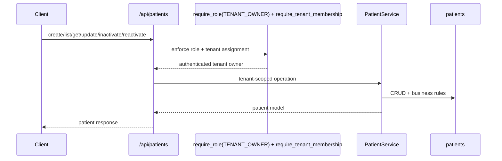

# Patient Feature

## Purpose

`src/features/patient` manages tenant-scoped patient registry operations, including full registration, quick registration, activation lifecycle, and profile metadata.

## Files

- `models.py`: `Patient` (`TenantMixin`, `TimestampMixin`, `AuditableMixin`), soft inactivation fields, and tenant CPF uniqueness.
- `schemas.py`: DTO validation for CPF/CEP/phone/name/date rules and minor guardian requirements.
- `service.py`: tenant-aware CRUD, quick registration completion, activation lifecycle handling.
- `router.py`: HTTP orchestration, role/tenant dependency wiring, commit boundaries, and conflict mapping.
- `exceptions.py`: patient domain exceptions.

## Core Rules

- Tenant scope is mandatory (`session.info["tenant_id"]`).
- `tenant_id` references `tenants.id` (foreign key).
- Access is restricted to `TENANT_OWNER` users assigned to the requested tenant.
- Full patient registration requires: name, birth date, CPF, CEP, phone, session price, session frequency.
- If patient is minor, `guardian_name` and `guardian_phone` are required.
- CPF is unique per tenant (`uq_patient_tenant_cpf`).
- Patient deletion is logical inactivation with 5-year retention metadata (`retention_expires_at`).
- Quick registration is supported with only `full_name`, and later completion (`/complete-registration`) marks patient as fully registered.

## Endpoints

- `POST /api/patients`
- `POST /api/patients/quick-register`
- `GET /api/patients`
- `GET /api/patients/{patient_id}`
- `PUT /api/patients/{patient_id}`
- `POST /api/patients/{patient_id}/complete-registration`
- `PATCH /api/patients/{patient_id}/profile-photo`
- `DELETE /api/patients/{patient_id}`
- `POST /api/patients/{patient_id}/reactivate`

## Test Coverage

- full + quick registration flows
- CPF uniqueness conflicts
- active/inactive lifecycle and list filtering
- minor guardian validation
- role and tenant-assignment access constraints
