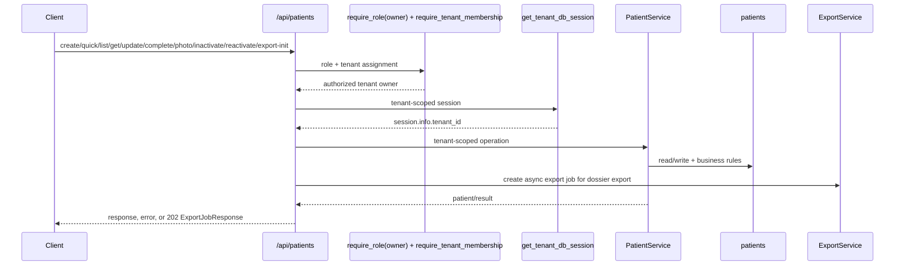
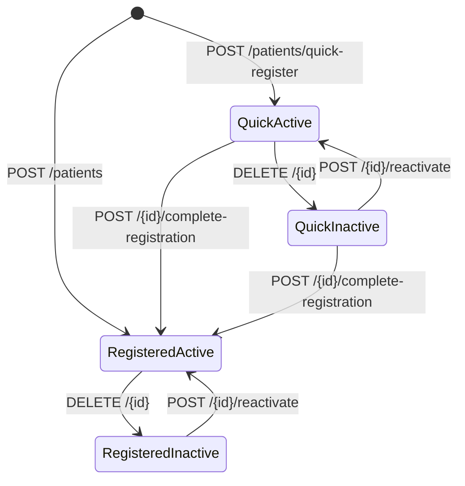
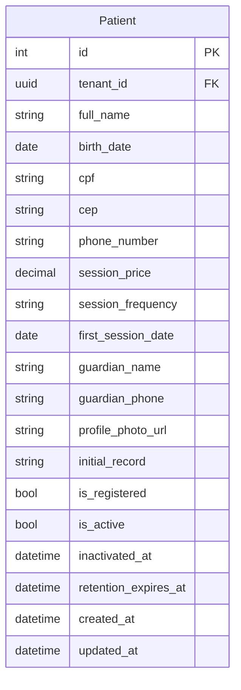

# Patient Feature

## Purpose

`src/features/patient` manages tenant-scoped patient records, including full registration, quick registration, registration completion, profile updates, active/inactive lifecycle with retention metadata, and complete patient dossier export initiation.

## Scope

Documented feature files:

- `src/features/patient/router.py`
- `src/features/patient/service.py`
- `src/features/patient/schemas.py`
- `src/features/patient/models.py`
- `src/features/patient/exceptions.py`
- `src/features/patient/storage.py`

Direct dependencies used by this feature:

- `src/features/auth/dependencies.py` (`require_role`, `require_tenant_membership`)
- `src/database/dependencies.py` (`get_tenant_db_session`)
- `src/features/export/service.py` (async export job creation)
- `src/features/export/schemas.py` (`ExportJobKind`, `ExportJobResponse`)
- `src/features/medical_record/models.py` (dossier medical-record history)
- `src/features/schedule/models.py` (dossier appointment and billing history)
- `src/shared/pagination/pagination.py` (`PaginationParams`)
- `src/shared/tenancy/dependencies.py` (`require_tenant` via tenant DB session)
- `src/database/client.py` (`set_tenant_context` sets `session.info["tenant_id"]`)

## Request Flow

## Lifecycle

## Data Model

## Schemas And Validation

### `PatientCreateRequest` (full registration)

Required:

- `full_name` (3..255)
- `birth_date`
- `cpf` (11 digits, CPF checksum-valid)
- `cep` (8 digits)
- `phone_number` (10 or 11 digits)
- `session_price` (decimal > 0, max digits 10, scale 2)
- `session_frequency` (trimmed non-blank, max 50)

Optional:

- `first_session_date`
- `guardian_name`, `guardian_phone`
- `profile_photo_url` (`HttpUrl`)
- `initial_record` (max 5000)

Business validation:

- names cannot start/end with spaces, cannot be blank, only letters/spaces/hyphens/apostrophes
- `birth_date` must be before today
- `first_session_date` cannot be before `birth_date`
- if patient is minor (`< 18`), both guardian fields are required

### `PatientQuickCreateRequest`

- only `full_name` with same name validation

### `PatientUpdateRequest`

- all editable fields optional
- per-field validation rules match create schema where applicable
- no built-in cross-field validator in this schema

Important update behavior:

- for already registered patients (`patient.is_registered == true`), router merges persisted + incoming values and validates merged state with `PatientCreateRequest`
- this preserves full-registration invariants during partial updates (for example minor guardian requirements)
- merged validation failures return `422`

### `PatientCompleteRegistrationRequest`

- extends `PatientCreateRequest` (same required fields and validations)

### `PatientProfilePhotoUpdateRequest`

- `profile_photo_url: HttpUrl | None`
- supports clearing photo by sending `null`

### Response DTOs

- `PatientResponse`: full patient state including `is_registered`, `is_active`, inactivation/retention timestamps
- `PatientListResponse`: paginated list envelope

## Access Rules

All `/api/patients/*` endpoints require:

- authenticated user with role `tenant_owner` (router-level `require_role(UserRole.TENANT_OWNER)`)
- valid tenant context (`X-Tenant-ID`, via tenant session dependency)
- authenticated user assigned to the requested tenant (`require_tenant_membership`)

## Endpoints

Base path is `/api/patients`.

### `POST /api/patients`

Creates fully registered patient.

Behavior:

- ensures CPF uniqueness within current tenant
- persists with `is_registered=true`, `is_active=true`
- router maps tenant CPF unique `IntegrityError` to `409`

Success:

- `200` `PatientResponse`

Errors:

- `409` `Patient CPF already registered in this tenant`
- `400` tenant header errors
- `401` authentication errors
- `403` role/tenant-membership/inactive-or-locked user errors
- `422` request validation errors

### `POST /api/patients/quick-register`

Creates patient with only name.

Behavior:

- persists with `is_registered=false`, `is_active=true`

Success:

- `200` `PatientResponse`

Errors:

- `400`/`401`/`403` access errors
- `422` validation errors

### `GET /api/patients`

Lists tenant patients.

Query params:

- `page`, `page_size` (pagination)
- `search`: optional 1..255
- `active_only`: bool, default `true`
- `is_registered`: optional bool

Filter behavior:

- always tenant-scoped
- `active_only=true` -> returns only active patients
- `active_only=false` -> returns active + inactive (no `is_active` filter)
- `is_registered` adds registration filter when provided
- `search` matches (`ILIKE`) against `full_name`, `cpf`, or `phone_number`
- ordering: `created_at DESC`, `id DESC`

Success:

- `200` `PatientListResponse`

Errors:

- `400`/`401`/`403` access errors
- `422` query validation errors

### `GET /api/patients/{patient_id}`

Returns one patient in current tenant.

Success:

- `200` `PatientResponse`

Errors:

- `404` `Patient not found`
- `400`/`401`/`403` access errors
- `422` invalid path parameter type

### `POST /api/patients/{patient_id}/export/pdf`

Queues a complete patient dossier PDF export.

Behavior:

- validates the patient exists in the current tenant
- creates an async export job with kind `patient_complete_pdf`
- the worker-generated PDF includes patient profile, appointment history, medical record history, and appointment-derived billing summary

Success:

- `202` `ExportJobResponse`

Errors:

- `404` `Patient not found`
- `400`/`401`/`403` access errors
- `422` invalid path parameter type

### `PUT /api/patients/{patient_id}`

Updates patient fields.

Behavior:

- patient must exist in current tenant
- if CPF changes, enforces tenant CPF uniqueness
- converts `profile_photo_url` to string when present
- for registered patients, merged payload is revalidated using `PatientCreateRequest`
- router maps tenant CPF unique `IntegrityError` to `409`

Success:

- `200` `PatientResponse`

Errors:

- `404` `Patient not found`
- `409` CPF conflict
- `400`/`401`/`403` access errors
- `422` direct schema validation or merged-state validation

### `POST /api/patients/{patient_id}/complete-registration`

Completes registration for quick patient.

Behavior:

- raises conflict if already fully registered
- applies full registration payload
- sets:
  - `is_registered=true`
  - `is_active=true`
  - `inactivated_at=None`
  - `retention_expires_at=None`
- if CPF differs from current value, enforces tenant CPF uniqueness
- router maps tenant CPF unique `IntegrityError` to `409`

Success:

- `200` `PatientResponse`

Errors:

- `404` `Patient not found`
- `409` already registered or CPF conflict
- `400`/`401`/`403` access errors
- `422` validation errors

### `PATCH /api/patients/{patient_id}/profile-photo`

Updates only profile photo URL.

Behavior:

- accepts URL or `null`

Success:

- `200` `PatientResponse`

Errors:

- `404` `Patient not found`
- `400`/`401`/`403` access errors
- `422` validation errors

### `DELETE /api/patients/{patient_id}`

Inactivates patient (logical delete).

Behavior:

- if already inactive -> conflict
- sets:
  - `is_active=false`
  - `inactivated_at=now`
  - `retention_expires_at = inactivated_at + 5 years` (leap-year safe)

Success:

- `200` `{"message": "Patient inactivated successfully"}`

Errors:

- `404` `Patient not found`
- `409` `Patient is already inactive`
- `400`/`401`/`403` access errors
- `422` invalid path parameter type

### `POST /api/patients/{patient_id}/reactivate`

Reactivates inactive patient.

Behavior:

- if already active -> conflict
- sets:
  - `is_active=true`
  - `inactivated_at=None`
  - `retention_expires_at=None`

Success:

- `200` `PatientResponse`

Errors:

- `404` `Patient not found`
- `409` `Patient is already active`
- `400`/`401`/`403` access errors
- `422` invalid path parameter type

## Service Logic

### `_require_tenant_id(session)`

- reads `session.info["tenant_id"]`
- raises runtime error when tenant context is missing

### `_ensure_cpf_available(session, cpf, exclude_patient_id=None)`

- validates CPF uniqueness inside current tenant
- skips check when CPF is `None`
- excludes current patient during update/complete-registration flows
- raises `PatientCpfAlreadyExists` when duplicate is found

### `is_patient_cpf_unique_violation(exc)`

- helper used by router to map DB `IntegrityError` on `uq_patient_tenant_cpf` to `409`

### `create_patient(session, data)`

- requires tenant context
- enforces CPF availability before insert
- creates fully registered active patient (`is_registered=true`, `is_active=true`)

### `create_quick_patient(session, data)`

- creates minimal patient with only name
- sets `is_registered=false`, `is_active=true`

### `list_patients(session, pagination, search, is_active, is_registered)`

- always tenant-scoped
- applies search and registration/activity filters through `_apply_filters`
- orders by `created_at DESC`, `id DESC`
- returns `(items, total)` with optional pagination

### `get_patient(session, patient_id)` / `require_patient(session, patient_id)`

- tenant-scoped lookup by patient id
- `require_patient` raises `PatientNotFound` when missing

### `update_patient(session, patient, data)`

- applies partial updates from payload
- enforces CPF uniqueness when CPF changes
- converts `profile_photo_url` to string when provided

### `complete_registration(session, patient, data)`

- rejects when patient is already registered (`PatientAlreadyRegistered`)
- applies full registration data
- enforces CPF uniqueness when CPF changed
- sets `is_registered=true`, `is_active=true`, clears inactivation/retention metadata

### `update_profile_photo(session, patient, profile_photo_url)`

- updates only `profile_photo_url` (including `None`)

### `inactivate_patient(session, patient)`

- rejects when already inactive (`PatientAlreadyInactive`)
- sets `is_active=false`, `inactivated_at=now`, `retention_expires_at=now+5 years`

### `reactivate_patient(session, patient)`

- rejects when already active (`PatientAlreadyActive`)
- sets `is_active=true` and clears inactivation/retention metadata

### `export_complete_patient_pdf(session, patient_id)`

- loads the patient in current tenant scope
- loads non-deleted appointments ordered by latest first
- loads medical records ordered by latest first
- renders one PDF with profile, appointment history, medical record history, and appointment-derived billing totals
- stores the file under `storage/patients/exports/<tenant-id>/...`

## Error Handling

Feature exceptions (`src/features/patient/exceptions.py`):

- `PatientNotFound` -> `404`
- `PatientCpfAlreadyExists` -> `409`
- `PatientAlreadyInactive` -> `409`
- `PatientAlreadyActive` -> `409`
- `PatientAlreadyRegistered` -> `409`

Dependency-originated errors:

- `400` missing/invalid tenant header
- `401` authentication failures
- `403` role/tenant-membership/inactive/locked user failures

Validation-originated errors:

- `422` field and business validation failures (including merged validation for registered patient updates)

## Side Effects

- create/update/complete/photo/inactivate/reactivate mutate `patients` rows in current tenant scope.
- inactivation stores retention deadline for logical record retention.
- patient model uses `AuditableMixin`, so insert/update operations in these flows write audit entries.
- tenant DB dependency sets transaction-scoped tenant context before service operations.
- export initiation validates the patient and enqueues a shared async export job.
- completed dossier files are stored under `storage/patients/exports/<tenant-id>/...`.

Transaction behavior:

- mutating router handlers call `session.commit()` explicitly
- session dependencies commit on successful request and roll back on unhandled exceptions

## Frontend Integration Notes

- Only tenant owners can use these endpoints; assistants receive `403`.
- Use quick registration for first-contact flows; finish later via `complete-registration`.
- Treat `DELETE /patients/{id}` as inactivation, not hard deletion.
- For lists, default behavior excludes inactive patients (`active_only=true`).
- Dossier export is async; after `POST /api/patients/{id}/export/pdf`, use the generic `/api/exports/*` endpoints for progress, SSE updates, and download.
