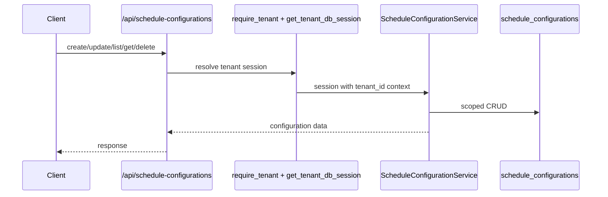

# Schedule Config Feature

## Purpose

`src/features/schedule_config` manages tenant-scoped schedule configuration records shared by all users in the tenant.

## Files

- `models.py`: `ScheduleConfiguration` (`TenantMixin`, `TimestampMixin`, `AuditableMixin`).
- `schemas.py`: weekday/time-window DTOs with validators.
- `service.py`: create/get/list/update/delete operations.
- `router.py`: tenant-scoped endpoints shared by tenant users.
- `exceptions.py`: schedule config exceptions.

## Core Rules

- One configuration per tenant (`uq_schedule_configuration_tenant`).
- `tenant_id` references `tenants.id` (foreign key).
- Tenant scope comes from `session.info["tenant_id"]` set by tenant DB dependency.
- Any authenticated tenant user (including assistants) can access the tenant configuration.
- Update flow re-validates merged state using `ScheduleConfigurationCreateRequest`.

## Endpoints

- `POST /api/schedule-configurations`
- `GET /api/schedule-configurations`
- `GET /api/schedule-configurations/{configuration_id}`
- `PUT /api/schedule-configurations/{configuration_id}`
- `DELETE /api/schedule-configurations/{configuration_id}`

## Requirements

- Requires authentication.
- Requires `X-Tenant-ID` header (router included with tenant dependency in `src/main.py`).
- Requires authenticated user to be assigned to requested tenant (`current_user.tenant_ids` must contain `X-Tenant-ID`).

## Test Coverage

- one-config-per-tenant rule
- shared tenant access checks
- pagination and schema validation behavior
