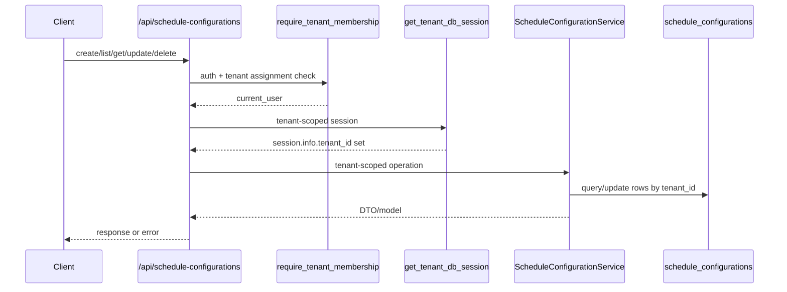
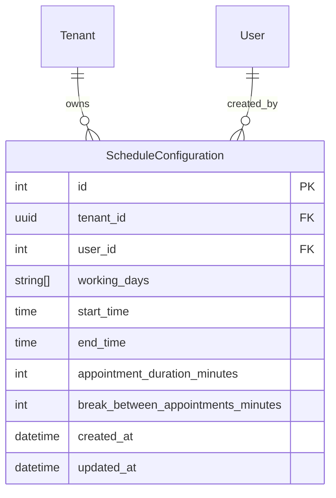

# Schedule Configuration Feature

## Purpose

`src/features/schedule_config` manages tenant-wide schedule configuration used by scheduling logic (working days, time window, appointment duration, break interval).

## Scope

Documented feature files:

- `src/features/schedule_config/router.py`
- `src/features/schedule_config/service.py`
- `src/features/schedule_config/schemas.py`
- `src/features/schedule_config/models.py`
- `src/features/schedule_config/exceptions.py`

Direct dependencies used by this feature:

- `src/features/auth/dependencies.py` (`require_tenant_membership`)
- `src/database/dependencies.py` (`get_tenant_db_session`)
- `src/shared/pagination/pagination.py` (`PaginationParams`)
- `src/shared/tenancy/dependencies.py` (`require_tenant` via `get_tenant_db_session`)
- `src/database/client.py` (`set_tenant_context` sets `session.info["tenant_id"]`)
- `src/main.py` (router is registered as tenant-protected with `Depends(require_tenant)`)

## Request Flow

## Data Model

## Schemas And Validation

### `ScheduleConfigurationCreateRequest`

- `working_days`: required list of `WeekDay`, min 1 item
- `start_time`: required
- `end_time`: required
- `appointment_duration_minutes`: required integer `> 0`
- `break_between_appointments_minutes`: required integer `>= 0`
- cross-field validator: `start_time` must be earlier than `end_time`

### `ScheduleConfigurationUpdateRequest`

- all fields optional
- per-field constraints match create schema
- built-in validator checks time ordering only when both `start_time` and `end_time` are provided in the same payload

Important update behavior:

- router merges current persisted values + payload and re-validates with `ScheduleConfigurationCreateRequest`
- this catches invalid partial updates (example: only changing `start_time` so merged window becomes invalid)
- merged-state validation errors are returned as `422` with Pydantic error list in `detail`

### `ScheduleConfigurationResponse`

- `id`, `user_id`, `working_days`, `start_time`, `end_time`
- `appointment_duration_minutes`, `break_between_appointments_minutes`
- `created_at`, `updated_at`

### `ScheduleConfigurationListResponse`

- `configurations: ScheduleConfigurationResponse[]`
- `total: int`
- `page: int`
- `page_size: int`

## Access Rules

All endpoints require:

- valid bearer token (`require_tenant_membership` dependency chain)
- `X-Tenant-ID` header (tenant-protected router + `get_tenant_db_session`)
- authenticated user assigned to requested tenant (`current_user.tenant_ids` contains requested tenant)

## Endpoints

Base path is `/api/schedule-configurations`.

### `POST /api/schedule-configurations`

Creates tenant configuration.

Request body: `ScheduleConfigurationCreateRequest`

Behavior:

- uses `current_user.id` as `user_id`
- enforces one configuration per tenant with:
  - service pre-check (`get_configuration_by_tenant`)
  - DB unique constraint fallback handling
- on commit `IntegrityError`, router maps tenant unique-constraint collisions to `409`

Success:

- `200` `ScheduleConfigurationResponse`

Errors:

- `409` `Schedule configuration already exists for this tenant`
- `400` missing/invalid `X-Tenant-ID` header
- `401` missing/invalid token
- `403` user not assigned to tenant / inactive / locked
- `422` schema validation error

### `GET /api/schedule-configurations`

Lists configurations for current tenant.

Query params (`PaginationParams`):

- `page`: optional integer `>= 1`, default `1`
- `page_size`: optional integer `1..1000`, default `50`

Behavior:

- returns only rows where `tenant_id == session.info["tenant_id"]`
- response always includes `page` and `page_size` (defaults to 1/50 if missing)

Success:

- `200` `ScheduleConfigurationListResponse`

Errors:

- `400` missing/invalid `X-Tenant-ID`
- `401` missing/invalid token
- `403` tenant-membership/auth status failures
- `422` invalid pagination values

### `GET /api/schedule-configurations/{configuration_id}`

Gets one configuration by id within current tenant.

Success:

- `200` `ScheduleConfigurationResponse`

Errors:

- `404` `Schedule configuration not found`
- `400` missing/invalid `X-Tenant-ID`
- `401` missing/invalid token
- `403` tenant-membership/auth status failures
- `422` invalid path parameter type

### `PUT /api/schedule-configurations/{configuration_id}`

Updates one configuration.

Request body: `ScheduleConfigurationUpdateRequest`

Behavior:

- loads configuration in current tenant scope; `404` if missing
- validates merged final state (current + update payload)
- applies only provided fields
- flushes and commits

Success:

- `200` `ScheduleConfigurationResponse`

Errors:

- `404` `Schedule configuration not found`
- `400` missing/invalid `X-Tenant-ID`
- `401` missing/invalid token
- `403` tenant-membership/auth status failures
- `422` direct payload validation error
- `422` merged-state validation error (from re-validation step)

### `DELETE /api/schedule-configurations/{configuration_id}`

Deletes one configuration in current tenant.

Behavior:

- hard delete via `session.delete(configuration)`
- returns success message

Success:

- `200` `{"message": "Schedule configuration deleted successfully"}`

Errors:

- `404` `Schedule configuration not found`
- `400` missing/invalid `X-Tenant-ID`
- `401` missing/invalid token
- `403` tenant-membership/auth status failures
- `422` invalid path parameter type

## Service Logic

### `_require_tenant_id(session)`

- every service method reads tenant from `session.info["tenant_id"]`
- missing tenant context raises `RuntimeError`

### `create_configuration(session, user_id, data)`

- prevents second config in same tenant (service check)
- stores weekday enum values as strings
- inserts row with tenant and creator user id

### `get_configuration(session, configuration_id)`

- filters by both `id` and current `tenant_id`

### `get_configuration_by_tenant(session)`

- returns single config for current tenant if present

### `list_configurations(session, pagination)`

- tenant-scoped count query + list query
- applies offset/limit when pagination enabled

### `update_configuration(session, configuration, data)`

- updates only provided fields
- flushes before returning updated model

### `delete_configuration(session, configuration_id)`

- resolves configuration in tenant scope
- deletes row when found
- returns `True` if deleted, `False` if not found

### `require_configuration(session, configuration_id)`

- loads configuration in current tenant scope
- raises `ScheduleConfigurationNotFound` when missing

### `is_tenant_unique_violation(exc)`

- detects unique-constraint failures for `uq_schedule_configuration_tenant`
- supports both structured `diag.constraint_name` and string fallback matching

## Error Handling

Feature exceptions:

- `ScheduleConfigurationNotFound` -> `404`
- `ScheduleConfigurationAlreadyExists` -> `409`

Dependency-originated errors:

- `400` tenant header missing/invalid (`require_tenant`)
- `401` authentication/token failures
- `403` tenant-membership check or inactive/locked user

Validation errors:

- `422` schema validation and merged-state time-window validation

## Side Effects

- create/update/delete mutate tenant-scoped rows in `schedule_configurations`
- create stores actor as `user_id` (creator reference)
- model includes `AuditableMixin`, so inserts/updates/deletes generate audit entries
- tenant DB dependency sets transaction-scoped PostgreSQL tenant context before operations

Transaction behavior:

- mutating router handlers call `session.commit()` explicitly
- session dependencies also commit on successful request and roll back on unhandled exceptions

## Frontend Integration Notes

- Always send `X-Tenant-ID` + bearer token for this feature.
- Any tenant member (owner or assistant) assigned to that tenant can access these endpoints.
- Expect at most one configuration per tenant; treat `409` as existing-config conflict.
- For updates, partial payloads can still fail `422` if merged final time window becomes invalid.
