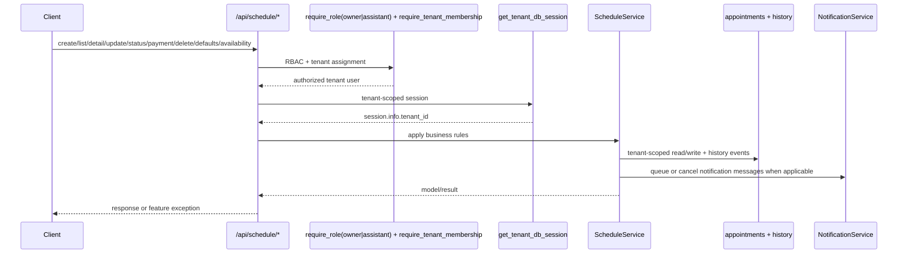
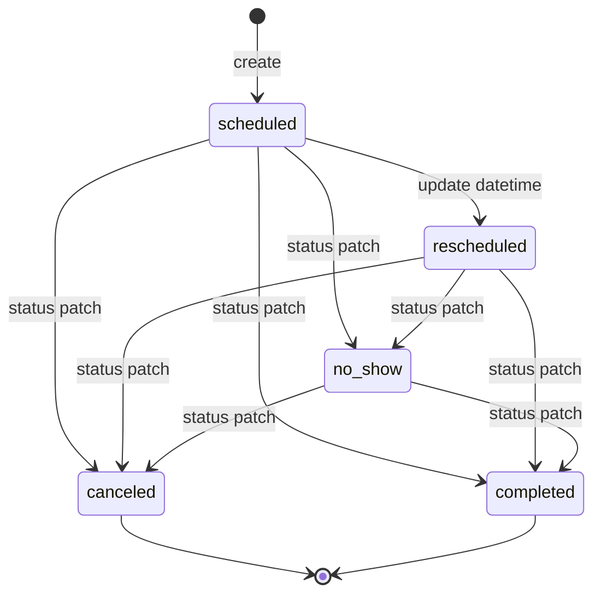
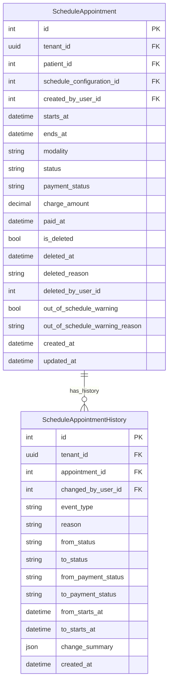

# Schedule Feature

## Purpose

`src/features/schedule` manages tenant-scoped consultation appointments, including creation, listing by calendar window, updates/reschedules, status/payment transitions, exceptional soft deletion, history timeline, defaults lookup, slot availability, and notification side effects for appointment lifecycle events.

## Scope

Documented feature files:

- `src/features/schedule/router.py`
- `src/features/schedule/service.py`
- `src/features/schedule/schemas.py`
- `src/features/schedule/models.py`
- `src/features/schedule/exceptions.py`

Direct dependencies used by this feature:

- `src/features/auth/dependencies.py` (`require_role`, `require_tenant_membership`)
- `src/database/dependencies.py` (`get_tenant_db_session`)
- `src/features/patient/models.py` (`Patient` lookup/active check)
- `src/features/notification/service.py` (`NotificationService` for confirmation, update, cancellation, and reminder hooks)
- `src/features/schedule_config/models.py` (`ScheduleConfiguration` defaults/constraints)
- `src/features/schedule_config/schemas.py` (`WeekDay` mapping for defaults response)
- `src/shared/pagination/pagination.py` (`PaginationParams`)

## Request Flow

## Appointment Lifecycle

## Data Model

## Schemas And Validation

### Enums

- `AppointmentStatus`: `scheduled`, `canceled`, `no_show`, `completed`, `rescheduled`
- `PaymentStatus`: `paid`, `pending`, `not_charged`
- `AppointmentModality`: `in_person`, `online`, `home_visit`, `hybrid`, `other`
- `ScheduleCalendarView`: `day`, `week`, `month`, `custom`

### `ScheduleAppointmentCreateRequest`

- `patient_id`: required, `> 0`
- `starts_at`: required timezone-aware datetime
- `ends_at`: optional timezone-aware datetime
- `modality`: required enum
- `notes`: optional, max 5000
- `price_override`: optional decimal `> 0`, max digits 10, scale 2
- `payment_status`: optional enum, default `pending`
- `allow_canceled_report`: optional bool, default `false`
- validator: if `ends_at` provided, must be after `starts_at`

### `ScheduleAppointmentUpdateRequest`

- all mutable fields optional: patient/time/modality/notes/price/payment/allow_canceled_report
- `starts_at`/`ends_at` must be timezone-aware when present
- validator only checks window when both provided in payload
- service resolves merged time window when only one field is sent

### `ScheduleAppointmentStatusUpdateRequest`

- `status`: required enum
- `reason`: optional, max 500
- `mark_as_not_charged`: bool, default false
- validation blocks:
  - `status=scheduled` (only auto-assigned on create)
  - `status=rescheduled` (must use update endpoint datetime change)

### `ScheduleAppointmentPaymentStatusUpdateRequest`

- `payment_status`: required enum
- `reason`: optional, max 500

### `ScheduleAppointmentDeleteRequest`

- `confirm`: required bool
- `reason`: required string, min 3, max 500

### Response DTOs

- `ScheduleAppointmentResponse`: full appointment state including deletion, warning, finance snapshot, and payment timestamp fields
- `ScheduleAppointmentDetailResponse`: base appointment + `history[]`
- `ScheduleAppointmentListResponse`: paginated list envelope
- `ScheduleDefaultsResponse`: tenant schedule config + default status/payment/modality values
- `ScheduleAvailabilityResponse`: date, working_day, slot/break minutes, available slots list

## Access Rules

All `/api/schedule/*` endpoints require:

- authenticated user with role `tenant_owner` OR `assistant` (router-level `require_role`)
- valid `X-Tenant-ID` tenant context (tenant-protected router + tenant DB session)
- authenticated user assigned to requested tenant (`require_tenant_membership`)

## Endpoints

Base path is `/api/schedule`.

### `POST /api/schedule/appointments`

Creates appointment.

Business rules:

- tenant must have schedule configuration (`409` otherwise)
- patient must exist in same tenant and be active
- `ends_at` defaults to `starts_at + config.appointment_duration_minutes` when omitted
- `charge_amount` snapshots the effective appointment amount using `price_override`, otherwise patient `session_price`, otherwise `0.00`
- `paid_at` is set immediately when an appointment is created with `payment_status=paid`
- final window must satisfy `ends_at > starts_at`
- `starts_at` must be in future (`> now UTC`)
- overlapping non-deleted, non-canceled appointments are rejected (`409`)
- appointment can be outside configured working days/hours; this is allowed but flagged in warning fields

Side effects:

- persists appointment with `status=scheduled`
- writes `created` history event
- queues confirmation and reminder notifications, then dispatches any due message immediately

Success:

- `200` `ScheduleAppointmentResponse`

Errors:

- `404` patient not found in tenant
- `409` inactive patient
- `409` missing schedule configuration
- `409` slot unavailable
- `400` invalid/past time window
- `400` tenant header issues
- `401` auth errors
- `403` role/tenant membership/inactive/locked user
- `422` schema validation

### `GET /api/schedule/appointments`

Lists appointments by calendar window and filters.

Query params:

- pagination: `page`, `page_size`
- `view`: `day|week|month|custom` (default `day`)
- `reference_date`: optional date (used for day/week/month)
- `start_date`, `end_date`: custom-range boundaries (required when `view=custom`)
- `patient_id`: optional `> 0`
- `statuses`: optional repeated query values
- `payment_statuses`: optional repeated query values
- `include_deleted`: bool, default false

Range semantics:

- filter uses overlap logic: `starts_at < range_end AND ends_at > range_start`
- `custom` requires both dates; `end_date` must be >= `start_date`

Success:

- `200` `ScheduleAppointmentListResponse`

Errors:

- `400` invalid custom range usage
- `400`/`401`/`403` access/tenant/auth failures
- `422` query validation

### `GET /api/schedule/appointments/{appointment_id}`

Returns appointment detail with timeline.

Query params:

- `include_deleted`: bool, default false

Behavior:

- when `include_deleted=false`, soft-deleted appointments are treated as not found
- history is ordered newest-first (`created_at desc`, `id desc`)
- response sets `history[].is_reschedule = (event_type == rescheduled)`

Success:

- `200` `ScheduleAppointmentDetailResponse`

Errors:

- `404` appointment not found in tenant scope
- `400`/`401`/`403` access/tenant/auth failures
- `422` path/query validation

### `PUT /api/schedule/appointments/{appointment_id}`

Updates appointment fields and handles rescheduling semantics.

Behavior:

- validates updated patient exists+active when `patient_id` changes
- merged time-window resolution:
  - both `starts_at` + `ends_at` provided: use both
  - only `starts_at` provided: preserves previous duration
  - only `ends_at` provided: start unchanged
- when time changes:
  - rejects moving to past
  - rejects overlap conflicts (excluding same appointment)
  - rejects reschedule from terminal statuses (`canceled`, `completed`)
  - auto-sets status to `rescheduled`
  - recalculates out-of-schedule warning fields
- if appointment amount is still mutable:
  - changing `price_override` refreshes `charge_amount`
  - changing patient without an override refreshes `charge_amount` from the new patient `session_price` or `0.00`
- payment status transitions also keep `paid_at` synchronized (`paid` sets timestamp, non-`paid` clears it)
- no-op updates (no changed fields) return unchanged appointment and no new history event
- event type:
  - `rescheduled` if time changed
  - `payment_status_changed` if only payment changed
  - otherwise `updated`

Side effects:

- `updated` and `rescheduled` events rebuild pending reminders for the appointment
- `updated` and `rescheduled` events queue immediate appointment-update notifications

Success:

- `200` `ScheduleAppointmentResponse`

Errors:

- `404` appointment/patient not found
- `409` missing schedule configuration
- `409` invalid transition or slot conflict or inactive patient
- `400` invalid/past time window
- `400`/`401`/`403` access/tenant/auth failures
- `422` request validation

### `PATCH /api/schedule/appointments/{appointment_id}/status`

Updates consultation status with transition validation.

Allowed transitions:

- `scheduled -> canceled|no_show|completed`
- `rescheduled -> canceled|no_show|completed`
- `no_show -> canceled|completed`
- `canceled` and `completed` are terminal

Additional rule:

- if target is `canceled` and `mark_as_not_charged=true`, payment status becomes `not_charged`
- when that change moves payment away from `paid`, `paid_at` is cleared

Side effects:

- writes `status_changed` history event with diff
- `status=canceled` cancels pending reminders and queues immediate cancellation notifications
- `status=no_show|completed` clears pending notifications for the appointment

Success:

- `200` `ScheduleAppointmentResponse`

Errors:

- `404` appointment not found
- `409` invalid transition
- `422` schema validation (e.g., `scheduled` or `rescheduled` rejected at schema layer)
- `400`/`401`/`403` access/tenant/auth failures

### `PATCH /api/schedule/appointments/{appointment_id}/payment-status`

Updates payment status.

Behavior:

- if new value equals current value: no change and no history event
- otherwise updates payment status, synchronizes `paid_at`, and writes `payment_status_changed` history event

Success:

- `200` `ScheduleAppointmentResponse`

Errors:

- `404` appointment not found
- `400`/`401`/`403` access/tenant/auth failures
- `422` request validation

### `DELETE /api/schedule/appointments/{appointment_id}`

Exceptional soft delete.

Request body: `ScheduleAppointmentDeleteRequest`

Behavior:

- requires `confirm=true`
- marks appointment as deleted (does not remove row)
- stores delete metadata (`deleted_at`, `deleted_reason`, `deleted_by_user_id`)
- writes `deleted` history event
- cancels any pending notification rows tied to the appointment
- endpoint fetches with `include_deleted=true`, so already-deleted records can return specific conflict instead of not found

Success:

- `200` `{"message": "Appointment deleted successfully"}`

Errors:

- `400` confirmation missing
- `409` appointment already deleted
- `404` appointment not found
- `400`/`401`/`403` access/tenant/auth failures
- `422` request validation

### `GET /api/schedule/defaults`

Returns defaults derived from tenant schedule configuration.

Success response includes:

- configuration values: working days, start/end time, duration, break
- fixed defaults:
  - `default_status = scheduled`
  - `default_payment_status = pending`
  - `default_modality = in_person`

Errors:

- `409` missing schedule configuration
- `400`/`401`/`403` access/tenant/auth failures

### `GET /api/schedule/availability`

Calculates available slots for date.

Query params:

- `target_date`: required date
- `slot_duration_minutes`: optional `> 0` (defaults from config)
- `break_between_appointments_minutes`: optional `>= 0` (defaults from config)

Behavior:

- if target weekday is not in configured working days: returns `working_day=false`, empty slots
- excludes conflicts with non-deleted, non-canceled appointments
- computes slots sequentially from configured day start until end, stepping by `duration + break`

Success:

- `200` `ScheduleAvailabilityResponse`

Errors:

- `409` missing schedule configuration
- `400`/`401`/`403` access/tenant/auth failures
- `422` query validation

## Service Logic

### `_require_tenant_id(session)`

- reads `session.info["tenant_id"]`
- raises runtime error when tenant context is missing

### `_require_schedule_configuration(session)`

- loads tenant `ScheduleConfiguration`
- raises `ScheduleConfigurationRequired` when missing

### `_require_patient(session, patient_id)`

- loads patient by `id` + tenant scope
- raises `SchedulePatientNotFound` when absent
- raises `SchedulePatientInactive` when inactive

### `create_appointment(session, user_id, data)`

- requires schedule configuration and active patient
- resolves `ends_at` from configuration when omitted
- validates future window and no overlap conflicts
- computes out-of-schedule warning flags
- creates appointment with `status=scheduled`
- snapshots `charge_amount` from override, patient price, or `0.00`
- sets `paid_at` when created directly as paid
- writes `created` history event
- triggers notification confirmation + reminder handling

### `list_appointments(session, pagination, ...)`

- resolves range via `_resolve_range` for `day|week|month|custom`
- filters by tenant, overlap window, optional patient/status/payment/deleted flags
- applies pagination and returns `(items, total)`

### `get_appointment(session, appointment_id, include_deleted=False)` / `require_appointment(...)`

- tenant-scoped lookup
- optional inclusion of deleted records
- `require_appointment` raises `ScheduleAppointmentNotFound` when missing

### `get_appointment_history(session, appointment_id)`

- tenant-scoped history lookup
- sorts by newest first (`created_at DESC`, `id DESC`)

### `update_appointment(session, user_id, appointment, data)`

- validates patient change when `patient_id` changes
- merges partial datetime updates using `_resolve_updated_window`
- rejects invalid/past windows and overlap conflicts
- blocks reschedule from terminal statuses (`canceled`, `completed`)
- when datetime changes, sets `status=rescheduled` and recalculates warning fields
- refreshes `charge_amount` only while the amount is still mutable
- synchronizes `paid_at` with payment status changes
- skips history write for no-op updates
- writes `rescheduled`, `payment_status_changed`, or `updated` history event
- for `updated` and `rescheduled`, refreshes appointment notifications and reminders

### `update_appointment_status(session, user_id, appointment, data)`

- validates transitions via `_STATUS_TRANSITIONS`
- optional `mark_as_not_charged=true` sets payment to `not_charged` on cancel
- clears `paid_at` when the payment state leaves `paid`
- writes `status_changed` history event
- on `canceled`, queues cancellation notifications; on `no_show|completed`, cancels pending notifications

### `update_payment_status(session, user_id, appointment, payment_status, reason)`

- no-op when status is unchanged
- otherwise updates payment status, synchronizes `paid_at`, and writes `payment_status_changed` history event

### `delete_appointment(session, user_id, appointment, data)`

- requires `confirm=true`
- rejects already-deleted records
- performs soft delete and stores delete metadata
- writes `deleted` history event
- cancels pending notification rows for the appointment

### `get_defaults(session)` / `get_available_slots(session, target_date, ...)`

- `get_defaults` returns tenant schedule configuration
- availability validates duration/break values
- returns `working_day=false` with empty slots when weekday is outside configured days
- computes sequential free slots excluding non-deleted, non-canceled overlaps

## Error Handling

Feature exceptions (`src/features/schedule/exceptions.py`):

- `ScheduleAppointmentNotFound` -> `404`
- `SchedulePatientNotFound` -> `404`
- `SchedulePatientInactive` -> `409`
- `ScheduleConfigurationRequired` -> `409`
- `ScheduleSlotUnavailable` -> `409`
- `ScheduleInvalidStatusTransition` -> `409`
- `ScheduleAppointmentAlreadyDeleted` -> `409`
- `ScheduleAppointmentInPast` -> `400`
- `ScheduleInvalidTimeWindow` -> `400`
- `ScheduleDeleteConfirmationRequired` -> `400`
- `ScheduleCustomRangeRequired` -> `400`
- `ScheduleInvalidCustomRange` -> `400`

Dependency-originated errors:

- `400` tenant header missing/invalid
- `401` authentication failures
- `403` role/tenant membership/inactive/locked failures

## Side Effects

- create/update/status/payment/delete operations write timeline events in `schedule_appointment_history`.
- create, update, cancel, no-show, completed, and delete flows also maintain notification outbox state through `NotificationService`.
- update with datetime change enforces status mutation to `rescheduled` automatically.
- canceled appointments are excluded from slot-conflict checks and availability occupancy checks.
- soft-deleted appointments are excluded from list/detail by default and from slot-conflict checks.
- every appointment persists a finance snapshot in `charge_amount`; patient price changes later do not retroactively rewrite existing appointments.
- finance reports derive automatic consultation revenue from paid, non-deleted appointments using `charge_amount` + `paid_at`.
- both appointment model and history model are tenant-scoped; operations always use `session.info["tenant_id"]`.

Transaction behavior:

- mutating router handlers call `session.commit()` explicitly
- session dependencies commit on successful request and roll back on unhandled exceptions

## Frontend Integration Notes

- Always send `X-Tenant-ID` and bearer token.
- Handle `409` as business-rule conflicts (slot unavailable, invalid transitions, missing config, inactive patient).
- Use `GET /appointments/{id}` to render timeline; events already come sorted newest-first.
- Read `charge_amount` and `paid_at` from appointment responses when rendering billing state.
- For custom list view, always send both `start_date` and `end_date`.
- To show deleted records in admin/support screens, set `include_deleted=true` on list/detail.
