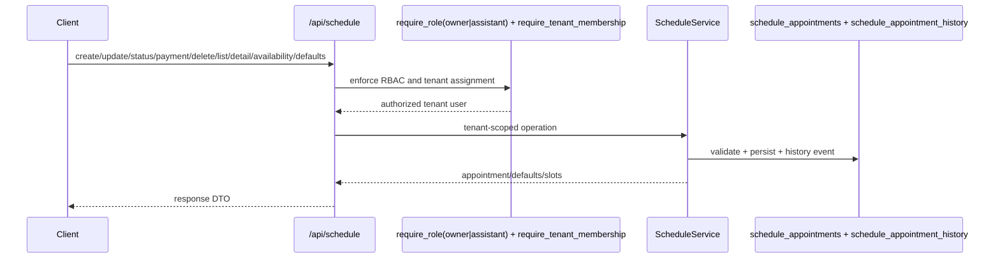

# Schedule Feature

## Purpose

`src/features/schedule` manages tenant-scoped consultation scheduling lifecycle: creation, availability lookup, filtering views, status/payment transitions, rescheduling history, and exceptional deletion.

## Files

- `models.py`: `ScheduleAppointment` and `ScheduleAppointmentHistory` tenant models.
- `schemas.py`: appointment/status/payment/defaults/availability DTOs and enum contracts.
- `service.py`: scheduling business rules, conflict checks, availability generation, and timeline writes.
- `router.py`: HTTP orchestration, dependency wiring, and commit boundaries.
- `exceptions.py`: schedule domain exceptions.

## Core Rules

- Tenant context is mandatory (`session.info["tenant_id"]`).
- Access is restricted to `TENANT_OWNER` and `ASSISTANT` roles assigned to the tenant.
- Appointment creation requires existing active patient + existing schedule configuration.
- Appointments in past datetimes are rejected.
- Occupied time windows are rejected (`409 Conflict`).
- `scheduled` status is assigned automatically on creation and cannot be set manually later.
- Rescheduling (datetime change) automatically marks status as `rescheduled` and records history.
- Cancellation can optionally mark payment as `not_charged`.
- Deletion is exceptional and requires explicit confirmation payload.
- Detail endpoint includes appointment timeline events, with reschedule events highlighted.

## Endpoints

- `POST /api/schedule/appointments`
- `GET /api/schedule/appointments`
- `GET /api/schedule/appointments/{appointment_id}`
- `PUT /api/schedule/appointments/{appointment_id}`
- `PATCH /api/schedule/appointments/{appointment_id}/status`
- `PATCH /api/schedule/appointments/{appointment_id}/payment-status`
- `DELETE /api/schedule/appointments/{appointment_id}`
- `GET /api/schedule/defaults`
- `GET /api/schedule/availability`

## Test Coverage

- slot conflict prevention
- past datetime blocking
- owner + assistant access behavior
- rescheduling + history entries
- status/payment transitions
- availability slot generation
- exceptional delete confirmation behavior
