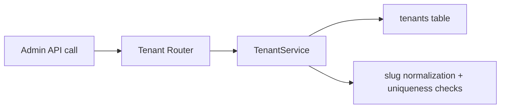

# Tenant Feature

## Purpose

`src/features/tenant` manages globally-scoped tenant records used as workspace boundaries for tenant-scoped data.

## Files

- `models.py`: `Tenant` model.
- `schemas.py`: create/update/list DTOs.
- `service.py`: slug generation, uniqueness checks, CRUD logic.
- `router.py`: admin-only tenant endpoints.
- `exceptions.py`: tenant domain exceptions.

## Core Rules

- Tenant names and slugs must be unique.
- Slugs are normalized and validated (`^[a-z0-9]+(?:-[a-z0-9]+)*$`).
- Delete endpoint is a soft deactivation (`is_active=False`), not hard delete.
- Router is admin-only via router-level dependency.

## Endpoints

- `POST /api/tenants`
- `GET /api/tenants`
- `GET /api/tenants/{tenant_id}`
- `PUT /api/tenants/{tenant_id}`
- `DELETE /api/tenants/{tenant_id}`

## Test Coverage

- slug generation and collision handling
- admin authorization behavior
- CRUD API behavior
