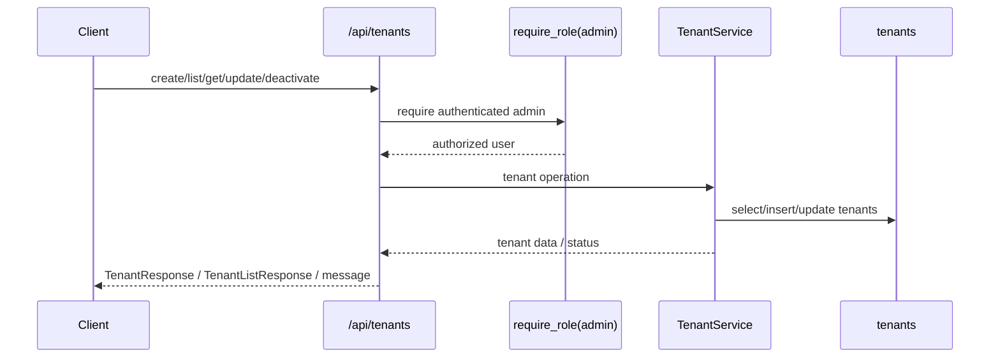
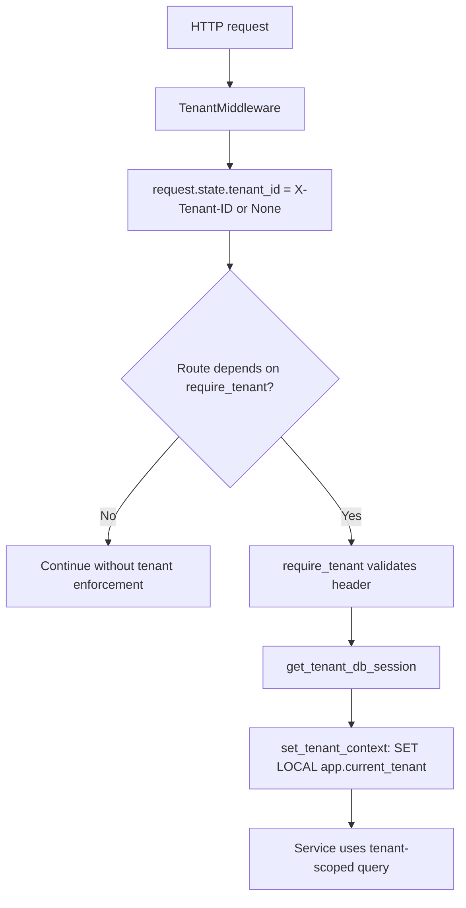
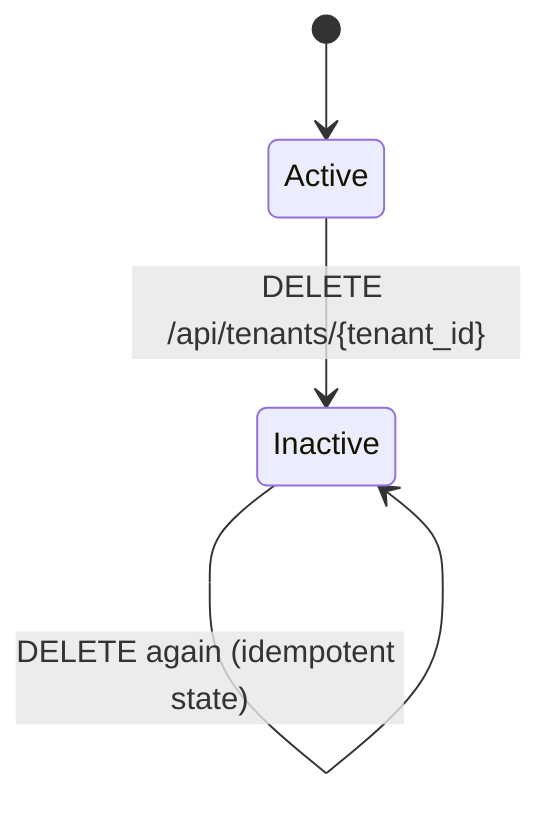
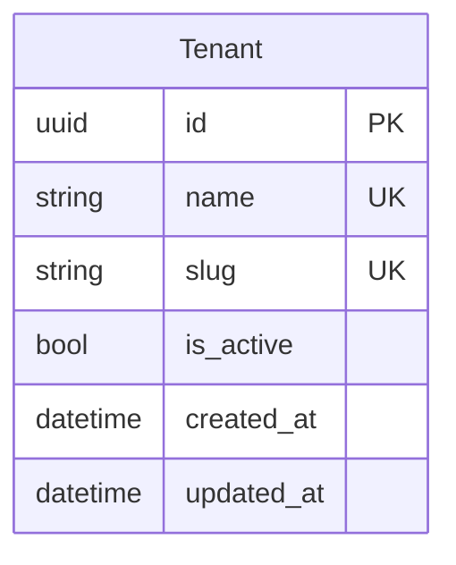

# Tenant Feature

## Purpose

`src/features/tenant` manages global tenant records (`tenants` table) used as workspace boundaries.

This document also covers the shared tenancy layer in `src/shared/tenancy`, because it defines how tenant-protected routes enforce `X-Tenant-ID` and set tenant context for database isolation.

## Scope

Documented feature files:

- `src/features/tenant/router.py`
- `src/features/tenant/service.py`
- `src/features/tenant/schemas.py`
- `src/features/tenant/models.py`
- `src/features/tenant/exceptions.py`

Documented shared tenancy files:

- `src/shared/tenancy/tenant_middleware.py`
- `src/shared/tenancy/dependencies.py`

Direct dependencies used by this feature:

- `src/features/auth/dependencies.py` (`get_current_active_user`, `require_role`, `require_tenant_membership`)
- `src/features/user/models.py` (`UserRole` for admin guard)
- `src/shared/pagination/pagination.py` (`PaginationParams`)
- `src/database/dependencies.py` (`get_db_session`, `get_tenant_db_session`)
- `src/database/client.py` (`set_tenant_context`)
- `src/database/base.py` (`TenantMixin`)
- `src/main.py` (router registration, tenant header OpenAPI security mapping, middleware wiring)

## Request Flow

## Shared Tenancy Flow

## Lifecycle

## Data Model

## Schemas And Validation

### `TenantCreateRequest`

- `name`: required, min `2`, max `255`
- `slug`: optional, min `2`, max `120`

### `TenantUpdateRequest`

- `name`: optional, min `2`, max `255`
- `slug`: optional, min `2`, max `120`
- note: `is_active` is not updatable through this schema

### `TenantResponse`

- `id`, `name`, `slug`, `is_active`, `created_at`, `updated_at`

### `TenantListResponse`

- `tenants: TenantResponse[]`
- `total: int`
- `page: int`
- `page_size: int`

## Access Rules

All tenant feature endpoints require:

- authenticated active/unlocked user (`get_current_active_user`)
- admin role (`require_role(UserRole.ADMIN)`)

## Endpoints

Base path is `/api/tenants`.

### `POST /api/tenants`

Creates a tenant.

Request body: `TenantCreateRequest`

Behavior:

- rejects duplicate `name`
- unknown extra fields are ignored by request model parsing (for example `is_active` in payload has no write effect)
- if `slug` provided:
  - normalize to lowercase + trim
  - validate pattern `^[a-z0-9]+(?:-[a-z0-9]+)*$`
  - reject duplicate slug
- if `slug` omitted:
  - auto-generate from `name` via `_slugify`
  - collision strategy: append `-2`, `-3`, ...

Success:

- `200` `TenantResponse`

Errors:

- `400` `Tenant name already exists`
- `400` `Tenant slug already exists`
- `400` `Tenant slug is invalid`
- `401` missing/invalid bearer token
- `403` non-admin / inactive / locked
- `422` schema validation error

### `GET /api/tenants`

Lists tenants.

Query params (`PaginationParams`):

- `page`: optional integer `>= 1`, default `1`
- `page_size`: optional integer `1..1000`, default `50`

Behavior:

- returns active and inactive tenants (no `is_active` filter)
- applies offset/limit only when pagination is enabled

Success:

- `200` `TenantListResponse`

Errors:

- `401` missing/invalid bearer token
- `403` non-admin / inactive / locked
- `422` invalid pagination params

### `GET /api/tenants/{tenant_id}`

Returns a tenant by UUID (active or inactive).

Success:

- `200` `TenantResponse`

Errors:

- `404` `Tenant not found`
- `401` missing/invalid bearer token
- `403` non-admin / inactive / locked
- `422` invalid UUID format

### `PUT /api/tenants/{tenant_id}`

Updates tenant name/slug.

Request body: `TenantUpdateRequest`

Behavior:

- when `name` changes:
  - enforces unique `name`
  - updates `tenant.name`
  - if `slug` not provided, auto-regenerates unique slug from new name
- when `slug` provided:
  - normalizes + validates pattern
  - enforces uniqueness excluding current tenant
  - updates `tenant.slug`
- unknown extra fields are ignored by request model parsing
- always sets `updated_at = now`

Success:

- `200` `TenantResponse`

Errors:

- `404` `Tenant not found`
- `400` `Tenant name already exists`
- `400` `Tenant slug already exists`
- `400` `Tenant slug is invalid`
- `401` missing/invalid bearer token
- `403` non-admin / inactive / locked
- `422` validation error

### `DELETE /api/tenants/{tenant_id}`

Deactivates tenant (soft delete).

Behavior:

- does not remove DB row
- sets `is_active = false`
- sets `updated_at = now`
- repeated calls keep tenant inactive (same final state)

Success:

- `200` `{"message": "Tenant deactivated successfully"}`

Errors:

- `404` `Tenant not found`
- `401` missing/invalid bearer token
- `403` non-admin / inactive / locked
- `422` invalid UUID format

## Service Logic

### `_slugify(value)`

- normalizes Unicode to ASCII (`NFKD`)
- lowercases and converts non-alphanumeric sequences to `-`
- collapses repeated hyphens and trims boundaries
- fallback value is `tenant` when normalized result is empty
- limits slug to 120 chars

### `_normalize_and_validate_slug(value)`

- trims + lowercases user-provided slug
- validates `^[a-z0-9]+(?:-[a-z0-9]+)*$`
- trims final value to max 120 chars
- raises `TenantInvalidSlug` when invalid

### `_ensure_slug_available(session, slug, exclude_tenant_id=None)`

- checks for slug collisions
- excludes current tenant during update flows
- raises `TenantSlugAlreadyExists` on collision

### `_generate_unique_slug(session, name, exclude_tenant_id=None)`

- builds base slug from `_slugify`
- probes uniqueness and appends numeric suffix (`-2`, `-3`, ...) when needed
- excludes current tenant during update flows

### `create_tenant(session, data)`

- enforces unique tenant name
- validates/uses explicit slug or auto-generates unique slug from name
- creates tenant with `is_active=true`

### `get_tenant(session, tenant_id)` / `get_tenants(session, pagination)`

- `get_tenant` returns one tenant by UUID (including inactive)
- `get_tenants` returns count + list with optional pagination
- no `is_active` filter is applied in list/get operations

### `update_tenant(session, tenant, data)`

- when name changes, enforces uniqueness and updates slug if payload omitted slug
- when slug provided, normalizes/validates/enforces uniqueness
- sets `updated_at = now`

### `delete_tenant(tenant)`

- soft deactivation only (`is_active=false`)
- sets `updated_at = now`

## Shared Tenancy Logic

### `TenantMiddleware` (`src/shared/tenancy/tenant_middleware.py`)

- runs on all requests
- reads `X-Tenant-ID` header
- stores value into `request.state.tenant_id` (or `None`)
- does not validate and does not raise by itself

### `require_tenant` (`src/shared/tenancy/dependencies.py`)

- reads `request.state.tenant_id`
- errors:
  - `400` `X-Tenant-ID header is required` when missing
  - `400` `X-Tenant-ID must be a valid UUID` when malformed
- returns validated UUID

### `get_tenant_db_session` (`src/database/dependencies.py`)

- calls `require_tenant`
- opens async session
- calls `set_tenant_context(session, tenant_id)`

### `set_tenant_context` (`src/database/client.py`)

- executes `SET LOCAL app.current_tenant = '<uuid>'`
- stores `session.info["tenant_id"] = tenant_id`
- tenant context is transaction-scoped

### `TenantMixin` (`src/database/base.py`)

- adds `tenant_id` FK (`tenants.id`) for tenant-scoped models
- intended for models protected by tenant context and RLS

### OpenAPI and router-level enforcement (`src/main.py`)

- `TenantMiddleware` is registered globally
- tenant-protected routers (`schedule_config`, `schedule`, `patient`) are included with `dependencies=[Depends(require_tenant)]`
- public/global routers include `tenant`, `user`, `auth` (no global `X-Tenant-ID` requirement)
- OpenAPI adds `TenantHeader` security requirement only for operations that depend on `require_tenant`

### Membership guard used by tenant-protected features

`require_tenant_membership` (`src/features/auth/dependencies.py`):

- depends on `require_tenant` + authenticated current user
- checks `tenant_id in current_user.tenant_ids`
- raises `403` if user is not assigned to requested tenant

## Error Handling

Tenant feature exceptions (`src/features/tenant/exceptions.py`):

- `TenantNotFound` -> `404`
- `TenantNameAlreadyExists` -> `400`
- `TenantSlugAlreadyExists` -> `400`
- `TenantInvalidSlug` -> `400`

Auth/authorization errors from auth dependencies:

- `401` for missing/invalid token
- `403` for non-admin user, inactive user, or locked user

Shared tenancy header errors (`require_tenant`):

- `400` missing tenant header
- `400` malformed tenant UUID

## Side Effects

- Tenant create/update/deactivate mutates `tenants` rows and updates `updated_at` where applicable.
- Tenant deactivation does not cascade deletion from tenant feature code path; it only flips `is_active`.
- `Tenant` is `AuditableMixin`, so insert/update operations generate audit entries.
- `get_tenant_db_session` sets per-transaction tenant context in PostgreSQL for tenant-protected routes.

Transaction behavior:

- mutating tenant router handlers call `session.commit()` explicitly
- session dependencies also commit on successful request and roll back on unhandled exceptions

## Frontend Integration Notes

- `/api/tenants` endpoints are platform-admin endpoints; send bearer token with admin role.
- If you send `is_active` in create/update payloads, backend parsing currently ignores it (no write effect).
- For tenant-scoped product endpoints (schedule/patient/config), always send `X-Tenant-ID` with a valid UUID.
- Handle `400` tenant-header errors distinctly from `401/403` auth/authorization errors.
