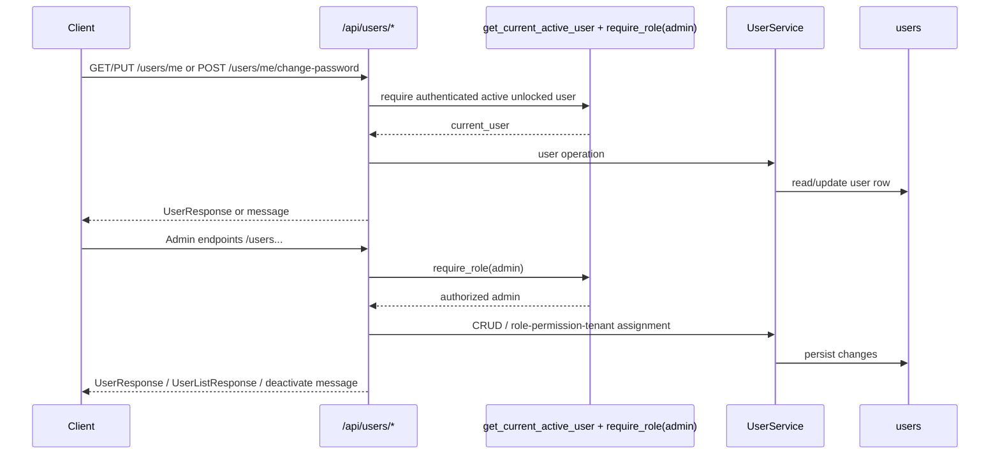
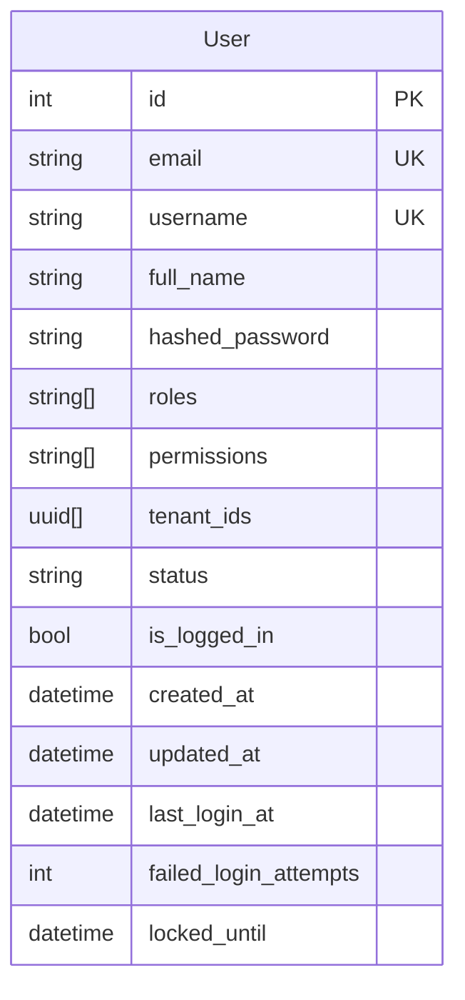

# User Feature

## Purpose

`src/features/user` manages user profile operations, admin user management, role/permission/tenant assignment, password changes, and user deactivation.

## Scope

Documented feature files:

- `src/features/user/router.py`
- `src/features/user/service.py`
- `src/features/user/schemas.py`
- `src/features/user/models.py`
- `src/features/user/exceptions.py`

Direct dependencies used by this feature:

- `src/features/auth/dependencies.py` (`get_current_active_user`, `require_role`)
- `src/features/auth/exceptions.py` (authorization/authentication error shapes)
- `src/features/auth/service.py` (`revoke_all_user_tokens`, used during deactivation)
- `src/shared/validators/password.py` (password strength validation)
- `src/shared/pagination/pagination.py` (`PaginationParams`)
- `src/database/dependencies.py` and `src/database/client.py` (global DB session + transaction behavior)
- `src/shared/audit/audit.py` (`AuditableMixin`, audit actor context)

## Request Flow

## Data Model

## Schemas And Validation

### `UserRegisterRequest`

- `email`: required valid email
- `username`: required string, `min=3`, `max=50`
- `full_name`: required string, `min=1`, `max=200`
- `password`: required string, `min=8`, must contain uppercase + lowercase + digit
- `confirm_password`: required string, `min=8`, must equal `password`

### `UserUpdateRequest`

- `full_name`: optional string, `min=1`, `max=200`
- `email`: optional valid email

### `PasswordChangeRequest`

- `current_password`: required string, `min=8`
- `new_password`: required string, `min=8`, must contain uppercase + lowercase + digit
- `confirm_new_password`: required string, must equal `new_password`

### `AssignRolesRequest`

- `roles`: required `list[UserRole]`, minimum 1 item
- allowed values: `admin`, `tenant_owner`, `assistant`

### `AssignPermissionsRequest`

- `permissions`: required `list[str]`, minimum 1 item

### `AssignTenantsRequest`

- `tenant_ids`: `list[UUID]` (empty list allowed)

### Response DTOs

`UserResponse` fields:

- `id`, `email`, `username`, `full_name`
- `roles` (enum values)
- `permissions`
- `tenant_ids`
- `status` (`active`, `inactive`, `locked`)
- `created_at`
- `last_login_at` (nullable)

`UserListResponse` fields:

- `users: UserResponse[]`
- `total: int`
- `page: int`
- `page_size: int`

## Endpoints

Base path is `/api/users`.

### Self Endpoints

### `GET /api/users/me`

Returns current authenticated user profile.

Success:

- `200` `UserResponse`

Errors:

- `401` missing/invalid bearer token
- `403` inactive or locked account

### `PUT /api/users/me`

Updates current user profile.

Request body: `UserUpdateRequest`

Behavior:

- only `full_name` and `email` are updated
- fields set to `null` are ignored
- `updated_at` is always refreshed

Success:

- `200` `UserResponse`

Errors:

- `400` `Email already registered` (duplicate email)
- `401` missing/invalid bearer token
- `403` inactive or locked account
- `422` validation error

### `POST /api/users/me/change-password`

Changes current user password.

Request body: `PasswordChangeRequest`

Behavior:

- verifies `current_password` against stored hash
- replaces `hashed_password` with new Argon2 hash
- updates `updated_at`
- changing to the same password is allowed (if validation passes)

Success:

- `200` `{"message": "Password changed successfully"}`

Errors:

- `400` `Current password is incorrect`
- `401` missing/invalid bearer token
- `403` inactive or locked account
- `422` validation error

### Admin Endpoints

All admin endpoints require `require_role(UserRole.ADMIN)`.

### `POST /api/users`

Creates a new user.

Request body: `UserRegisterRequest`

Business defaults applied on creation:

- `roles = ["tenant_owner"]`
- `status = "active"`
- `is_logged_in = false`
- `permissions = []`
- `tenant_ids = []`

Success:

- `200` `UserResponse`

Errors:

- `400` `Username already registered`
- `400` `Email already registered`
- `401` missing/invalid bearer token
- `403` non-admin / inactive / locked
- `422` validation error

### `GET /api/users`

Returns users list.

Query params (`PaginationParams`):

- `page`: optional integer `>= 1`, default `1`
- `page_size`: optional integer `1..1000`, default `50`

Behavior:

- executes `select(User)` without explicit ordering
- if pagination is active, applies `offset` + `limit`

Success:

- `200` `UserListResponse`

Errors:

- `401` missing/invalid bearer token
- `403` non-admin / inactive / locked
- `422` invalid pagination values

### `GET /api/users/{user_id}`

Returns one user.

Success:

- `200` `UserResponse`

Errors:

- `404` `User not found`
- `401` missing/invalid bearer token
- `403` non-admin / inactive / locked
- `422` invalid path param type

### `PUT /api/users/{user_id}`

Updates one user.

Request body: `UserUpdateRequest`

Behavior:

- only `full_name` and `email` are mutable
- duplicate email check only runs when email value actually changes

Success:

- `200` `UserResponse`

Errors:

- `404` `User not found`
- `400` `Email already registered`
- `401` missing/invalid bearer token
- `403` non-admin / inactive / locked
- `422` validation error

### `POST /api/users/{user_id}/roles`

Replaces user roles with provided list.

Request body: `AssignRolesRequest`

Success:

- `200` `UserResponse`

Errors:

- `404` `User not found`
- `401` missing/invalid bearer token
- `403` non-admin / inactive / locked
- `422` invalid role or empty list

### `POST /api/users/{user_id}/permissions`

Replaces user permissions with provided list.

Request body: `AssignPermissionsRequest`

Success:

- `200` `UserResponse`

Errors:

- `404` `User not found`
- `401` missing/invalid bearer token
- `403` non-admin / inactive / locked
- `422` empty list or validation error

### `POST /api/users/{user_id}/tenants`

Replaces user tenant assignments.

Request body: `AssignTenantsRequest`

Behavior:

- complete replacement semantics (`tenant_ids` is overwritten)
- empty list is allowed (clears tenant assignments)

Success:

- `200` `UserResponse`

Errors:

- `404` `User not found`
- `401` missing/invalid bearer token
- `403` non-admin / inactive / locked
- `422` invalid UUIDs

### `DELETE /api/users/{user_id}`

Deactivates one user (admin-only).

Behavior:

- admin cannot deactivate own account (`current_user.id == user_id`)
- calls `UserService.deactivate_user(...)`
- sets `status = inactive`
- sets `is_logged_in = false`
- revokes all non-revoked refresh tokens for that user
- idempotent for existing users: repeated calls still return `200`

Success:

- `200` `{"message": "User deactivated successfully"}`

Errors:

- `400` `Cannot deactivate your own account`
- `404` `User not found`
- `401` missing/invalid bearer token
- `403` non-admin / inactive / locked
- `422` invalid path param type

## Service Logic

### `register_user(session, data)`

- checks username uniqueness
- checks email uniqueness
- hashes password using `User.hash_password` (Argon2 via `pwdlib`)
- constructs user with fixed defaults (tenant owner, active, not logged in, empty permissions/tenants)
- adds user to session

### `get_users(session, pagination)`

- gets total count with `select(func.count()).select_from(User)`
- fetches users with optional pagination offset/limit
- returns `(users, total)` tuple

### `get_user(session, user_id)`

- returns matching user or `None`

### `update_user(session, user, **kwargs)`

- supports only `full_name` and `email`
- duplicate-email check when changing email
- ignores keys with `None` values
- updates `updated_at`

### `change_password(user, current_password, new_password)`

- verifies current password
- raises `IncorrectPassword` on mismatch
- stores new password hash and updates `updated_at`

### `assign_roles(user, roles)`

- replaces `user.roles` with provided values
- updates `updated_at`

### `assign_permissions(user, permissions)`

- replaces `user.permissions`
- updates `updated_at`

### `assign_tenants(user, tenant_ids)`

- replaces `user.tenant_ids`
- updates `updated_at`

### `deactivate_user(session, user_id)`

- loads user by id; returns `False` when user does not exist
- revokes all active refresh tokens through `AuthService.revoke_all_user_tokens`
- updates:
  - `status = inactive`
  - `is_logged_in = false`
  - `updated_at = now`
- returns `True` for existing users (including already-inactive users)

## Error Handling

User feature exceptions (`src/features/user/exceptions.py`):

- `UserNotFound` -> `404`
- `UsernameAlreadyExists` -> `400`
- `EmailAlreadyExists` -> `400`
- `IncorrectPassword` -> `400`
- `CannotDeactivateOwnAccount` -> `400`

Authorization-related failures come from auth dependencies:

- authentication/token failures -> `401`
- inactive/locked/non-admin/insufficient permissions -> `403`

## Side Effects

- Write operations update `users` rows and `updated_at` timestamps.
- Password changes re-hash credentials; plaintext password is never stored.
- Role/permission/tenant assignment endpoints overwrite existing arrays (not additive merge).
- Deactivation keeps the user row and changes status to inactive.
- Deactivation sets `is_logged_in = false`.
- Deactivation revokes all active refresh tokens via `AuthService.revoke_all_user_tokens`.
- Because `User` includes `AuditableMixin`, insert/update operations in these flows generate audit log entries.
- `get_current_active_user` path sets current audit actor (`set_current_user`) before protected operations.

Transaction behavior:

- routers call `session.commit()` for mutating endpoints
- session dependency also commits on successful request and rolls back on unhandled exceptions

## Frontend Integration Notes

- Use `GET /api/users/me` as the source of current profile/roles/tenant assignments.
- Handle `401` (re-authenticate) separately from `403` (authenticated but blocked by status/role).
- For admin lists, send `page` and `page_size`; invalid values produce `422`.
- Role/permission/tenant assignment endpoints are full replacement operations, so send complete desired lists.
- Treat `DELETE /users/{user_id}` as a deactivation action (status change + token revocation), not account removal.
