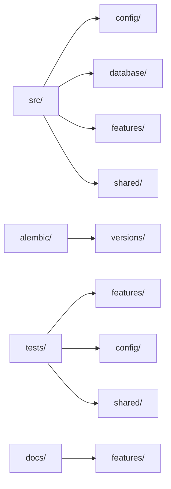

# Folder Organization

## Ownership by Folder

- `src/main.py`: app composition, middleware registration, router registration.
- `src/config/`: settings and CORS policy.
- `src/database/`: engine/session lifecycle, base mixins, dependency factories.
- `src/features/<feature>/models.py`: SQLAlchemy entities.
- `src/features/<feature>/schemas.py`: Pydantic request/response contracts.
- `src/features/<feature>/service.py`: business logic and persistence queries.
- `src/features/<feature>/router.py`: HTTP orchestration and dependency wiring.
- `src/features/<feature>/exceptions.py`: feature-specific HTTP exceptions.
- `src/features/auth/dependencies.py`: shared auth, role, permission dependencies.
- `src/shared/`: cross-feature concerns (tenancy, audit, pagination, validators, middleware).
- `alembic/versions/`: schema migration history.
- `tests/`: integration + service + utility test coverage.
- `docs/`: architecture and implementation documentation.

## Feature Package Contract

Each feature package should expose exactly one domain area and keep routers thin.

Required files for new features:

- `__init__.py`
- `models.py`
- `schemas.py`
- `service.py`
- `router.py`
- `exceptions.py`
