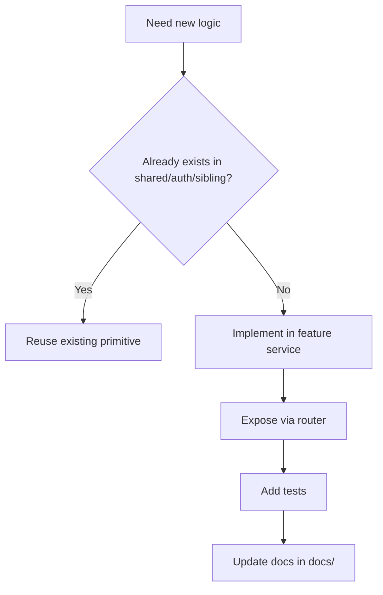

# Patterns and Rules

## Core Patterns

- Feature-based architecture with `models/schemas/service/router/exceptions` split.
- Business rules live in `service.py`; transport concerns live in `router.py`.
- Write commits happen at router boundary (`await session.commit()`).
- Shared primitives in `src/shared` and `src/features/auth/dependencies.py` must be reused instead of duplicated.

## Anti-Duplication Rules

1. Search first in:
- `src/shared/`
- `src/features/auth/dependencies.py`
- sibling feature services/schemas

2. Reuse existing helpers:
- password validation: `src/shared/validators/password.py`
- pagination: `src/shared/pagination/pagination.py`
- auth extraction and RBAC: `get_current_user`, `require_role`, `require_permission`
- tenant enforcement: `require_tenant`, `get_tenant_db_session`, `set_tenant_context`
- audit tracking: `AuditableMixin` + audit middleware/context

3. Do not duplicate JWT/auth logic outside `src/features/auth`.

## Required Delivery Checklist

- Router registered in `src/main.py` under correct group.
- Correct DB session dependency (global vs tenant) chosen.
- Migration created for schema changes.
- `alembic/env.py` imports updated for new models.
- Tests added or updated.
- Docs updated in `docs/`.
- Every new/updated doc file includes Mermaid.
