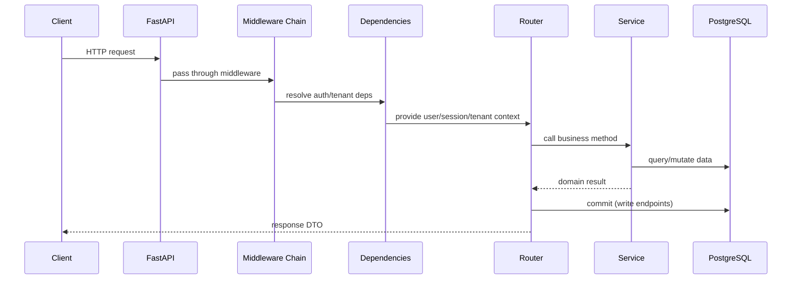

# System Flow

## Runtime Lifecycle

1. `src/main.py` starts the app and initializes database lifecycle hooks.
2. Middleware chain enriches and protects the request context.
3. Router dependencies enforce authentication, RBAC, and tenant requirements.
4. Router handlers map HTTP I/O to service calls.
5. Service layer executes business logic and persistence operations.
6. Router commits write transactions at endpoint boundary.

## Middleware Registration (as configured in `src/main.py`)

1. `SlowAPIMiddleware`
2. `admin_docs_middleware`
3. `CORSMiddleware`
4. `TenantMiddleware`
5. `AuditContextMiddleware`

## Dependency and Session Rules

- Use `get_db_session()` for global models (`User`, `Tenant`, `RefreshToken`, `AuditLog`).
- Use `get_tenant_db_session()` for tenant-scoped models (`ScheduleConfiguration`, `Patient`).
- `get_tenant_db_session()` validates `X-Tenant-ID` and runs `SET LOCAL app.current_tenant`.

## Router Grouping

- Public router group: `auth`, `user`, `tenant`.
- Tenant-protected router group: `schedule_config`, `patient` (includes `Depends(require_tenant)` at include time).
