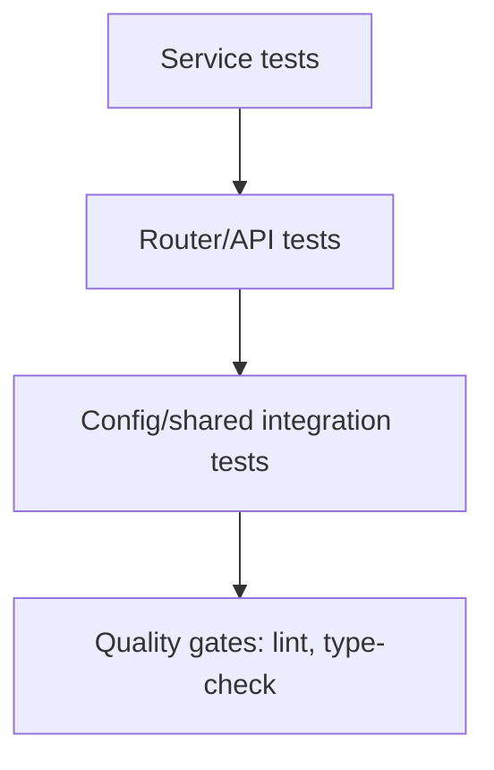

# Testing and Quality

## Test Strategy

- Test stack: `pytest` + `pytest-asyncio` + `httpx` ASGI transport.
- `tests/conftest.py` provides transactional isolation with savepoints.
- Tenant context is injected in test sessions via `set_tenant_context`.
- Dependency overrides keep API tests bound to the same transactional session.

## Coverage Areas in Current Suite

- `tests/features/auth`: authentication flows, token lifecycle, dependency behavior.
- `tests/features/user`: user service and API behavior (including RBAC and edge cases).
- `tests/features/tenant`: tenant service and admin APIs.
- `tests/features/schedule_config`: tenant-scoped schedule configuration behavior.
- `tests/features/schedule`: appointment lifecycle, availability, and status/payment transitions.
- `tests/features/patient`: patient registration, lifecycle, and tenant access behavior.
- `tests/features/audit`: diffing, serialization, and audit log creation.
- `tests/config`: CORS unit and integration coverage.
- `tests/shared`: tenancy and validator tests.

## Quality Commands

- `make lint`
- `make type-check`
- `make test`
- `make test-cov`

## Required Gates Before Merge

1. Relevant feature tests pass.
2. Full test suite passes when change touches shared/core layers.
3. Lint and type checks pass.
4. Docs updated (including Mermaid diagrams).
